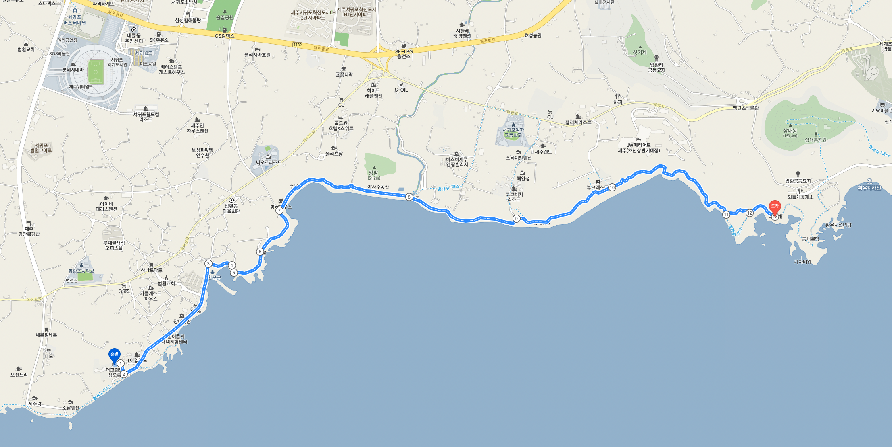

<h1>

한국정보과학회 프로그래밍언어연구회 겨울학교
  (SIGPL Winter School 2022)

</h1>

<table><tbody><tr><th align="left">
<ul>
<li>
    일시: 2022년 2월 12일(토) ~ 2022년 2월 14일(월)
</li><li>
    장소: 제주 더그랜드섬오름
</li><li>
    주최: 한국정보과학회 프로그래밍언어연구회
</li><li>
    후원: FuriosaAI
</li></ul>
</th></tr></tbody></table>

<h2>초대의 글</h2>

  한국정보과학회 프로그래밍언어 연구회에서 준비한 2022 겨울학교에 여러분을 초대합니다.
  Covid-19로 오랫동안 직접 뵙지 못한 아쉬운 마음이 커서 아직 완전히 종식되지 않은 상황에서도 겨울학교를 감행하기로 했습니다.
  이전에 우리 프로그래밍언어연구회는 열정적으로 최신 연구동향을 소개하고 활발히 교류했습니다.
  이번 겨울학교에서 학계 및 산업계에서 활발히 활동하시는 프로그래밍언어 분야 전문가 분들을 모시고 최신 연구를 듣는 강연들,
  무엇이든 물어보세요, 다수의 우수 학생 논문 발표, SIGPL 여름/겨울학교의 꽃인 학생분들의 포스터 발표가 준비되어 있습니다.
  많은 분들 뵙고 싶습니다. 많은 참여 부탁 드립니다.

한국정보과학회 프로그래밍언어연구회 운영위원장 정영범 (FuriosaAI) 드림

  조직위원장: 허기홍 (KAIST)
  프로그램위원장: 이우석 (한양대)

<h2>프로그램</h2>

<ul>
  <table border="0" cellspacing="0">
  <tbody><tr><td bgcolor="#cccccc">
  <table border="0" cellspacing="1pt">
<tbody>

  <tr><th colspan="3" align="left"> 2월 12일 (토요일)  </th></tr>
  <tr><td bgcolor="white">  10:00 ~ 11:00  </td><td bgcolor="white">  등록  </td><td bgcolor="white">   </td></tr>
  <tr><td bgcolor="white">  11:00 ~ 12:00  </td><td bgcolor="white">  SIGPL 운영위원회 </td><td bgcolor="white">  SIGPL 운영위원  </td></tr>
  <tr><td bgcolor="white">  12:00 ~ 13:00  </td><td bgcolor="white">  점심  </td><td bgcolor="white">   </td></tr>
  <tr><td bgcolor="white">  13:00 ~ 14:00  </td><td bgcolor="white">  LLVM과 MLIR 컴파일러 번역 검산하기  </td> 이준영 (Crypto Lab)<td bgcolor="white">   </td></tr>
  <tr><td bgcolor="white">  14:00 ~ 15:00  </td><td bgcolor="white">  주요연구 발표 </td><td bgcolor="white">   </td></tr>
  <tr><td bgcolor="white">  15:00 ~ 15:30  </td><td bgcolor="white">  휴식 </td><td bgcolor="white">   </td></tr>
  <tr><td bgcolor="white">  15:30 ~ 17:30  </td><td bgcolor="white">  번개발표 </td><td bgcolor="white">   </td></tr>
  <tr><td bgcolor="white">  17:30 ~ 19:00  </td><td bgcolor="white">  저녁 </td><td bgcolor="white">   </td></tr>
  <tr><td bgcolor="white">  19:00 ~ 21:00  </td><td bgcolor="white">  포스터 발표 </td><td bgcolor="white">  대학원생 </td> </tr>

  <tr><th colspan="3" align="left"> 2월 13일 (일요일)  </th></tr>
  <tr><td bgcolor="white">  10:00 ~ 11:00  </td><td bgcolor="white">  End-toend formatl verification on pKVM  </td>김지응 (Google)<td bgcolor="white">   </td></tr>
  <tr><td bgcolor="white">  11:00 ~ 12:00  </td><td bgcolor="white">  주요연구 발표</td><td bgcolor="white">  </td></tr>
  <tr><td bgcolor="white">  12:00 ~ 13:30  </td><td bgcolor="white">  점심  </td><td bgcolor="white">   </td></tr>
  <tr><td bgcolor="white">  13:30 ~ 15:30  </td><td bgcolor="white">  <a href="https://forms.gle/trWbVnjQq2w4BDSM9">무엇이든 물어보세요</a> </td><td bgcolor="white"> 이광근 (서울대), 류석영 (KAIST), 정영범 (FuriosaAI)  </td></tr>
  <tr><td bgcolor="white">  15:30 ~ 18:00  </td><td bgcolor="white">  단체 산책 </td><td bgcolor="white">  올레길 7코스 (폭풍의 언덕) </td></tr>
  <tr><td bgcolor="white">  18:00 ~        </td><td bgcolor="white">  만찬 </td><td bgcolor="white">   </td></tr>

  <tr><th colspan="3" align="left"> 2월 14일 (월요일)  </th></tr>
  <tr><td bgcolor="white">  10:00 ~ 11:00  </td><td bgcolor="white">  초청강연 </td><td bgcolor="white">   </td></tr>
  <tr><td bgcolor="white">  11:00 ~ 12:00  </td><td bgcolor="white">  번개발표</td><td bgcolor="white">  </td></tr>
  <tr><td bgcolor="white">  12:00 ~        </td><td bgcolor="white">  폐회  </td><td bgcolor="white">   </td></tr>

</tbody>
  </table></td></tr></tbody></table>
</ul>

## 등록

<ul>
    <li> 사전등록 마감: 2월 9일(수요일)
  </li><li> 등록 방법: <a href= "http://www.kiise.or.kr/conference/conf/102/" target="_blank"> 등록 페이지 </a>를 통하여 등록할 수 있습니다.
<table border="1" bordercolor="#a0a0a0" cellspacing="0">
<tbody><tr><th>&nbsp;</th><th>학생</th><th>일반</th></tr>
<tr align="center"><th>사전 등록 </th><td>80,000원</td><td>100,000원</td></tr>
<tr align="center"><th>현장 등록 </th><td>100,000원</td><td>120,000원</td></tr>
</tbody></table>
</li><li>무료 제공되는 식사는 일요일 저녁 만찬뿐입니다.</li></ul>

## 프로그램 안내
### 무엇이든 물어보세요
이번 SIGPL 겨울학교에서는 PL 학계와 산업계에 오랫동안 몸 담고 계신 분들을 모시고 "무엇이든 물어보세요" 세션을 진행합니다.
프로그래밍 언어를 공부하고 있는 학생들과 신진 연구자들께서는 평소 고민과 궁금증이 있다면 공유해 주세요.
자유롭게 <a href="https://forms.gle/trWbVnjQq2w4BDSM9">설문지</a>에 남겨주시면 됩니다.
선배 연구자들께서 여러분을 위해 기꺼이 귀 기울여 주시기로 했습니다.
### 산책
"영감은 길에서 나온다" 말이 있습니다. 새로운 곳에서 새로운 사람들과 걷다보면 번뜩이는 아이디어 불꽃이 종종 튈 때가 있지요.
그래서 둘째날 오후에는 <a href="http://www.jejuolle.org/trail/kor/olle_trail/default.asp?search_idx=9">올레길 7코스</a>를 함께 산책하려고 합니다.
호텔을 출발하여 동쪽으로 5km 떨어진 폭풍의 언덕에 도착하는 것이 목표입니다.
탁트인 바닷길을 같이 걸으며 즐거운 이야기 많이 나누길 기대합니다.
올레길에서 마주친 풍경과 동료들을 찍은 사진도 <a href="https://photos.app.goo.gl/KoYpXQCQEVDamsYm9">앨범</a>에 공유해주세요.

{: width="100%"}

## 숙박안내

학회 장소인 <a href="http://www.sumorum.com" target="_blank">더그랜드섬오름</a> 호텔에 개별적으로 예약해주시길 바랍니다.

## 식사안내

<ul>
  <li><a href="http://www.sumorum.com/upload/contents/BasaltRestaurant.pdf">바솔트 레스토랑</a> (호텔 신관 1층)</li>
  <li><a href="https://map.naver.com/v5/entry/place/1592243122?placePath=%2Fhome&c=14082835.3292459,3926221.9972572,17,0,0,0,dh">제주양반갈비</a> (갈비 전문 한식당, 도보 10분 거리) </li>
  <li><a href="https://map.naver.com/v5/entry/place/1926787057?placePath=%2Fhome&c=14082220.9347123,3926367.0877228,15,0,0,0,dh">다도</a> (전복 요리 전문점, 도보 10분거리) </li>
  <li><a href="https://map.naver.com/v5/entry/place/37289095?placePath=%2Fhome&c=14082216.4708007,3926544.9730715,15,0,0,0,dh">착한 삼촌</a> (흑돼지 삼겹살 전문점, 도보 15분거리) </li>
  <li><a href="https://map.naver.com/v5/search/%EC%9B%94%EB%93%9C%EC%BB%B5%ED%9D%91%EB%8F%BC%EC%A7%80/place/36938066?c=14081555.5447200,3927605.9134877,15,0,0,0,dh&placePath=%3Fentry%253Dbmp">월드컵 흑돼지</a> (흑돼지 삼겹살 전문점, 자동차 5분 거리) </li>
</ul>

## 오시는 길

호텔 <a href="http://www.sumorum.com/introduction/location">홈페이지</a>를 참고해 주시기 바랍니다.
