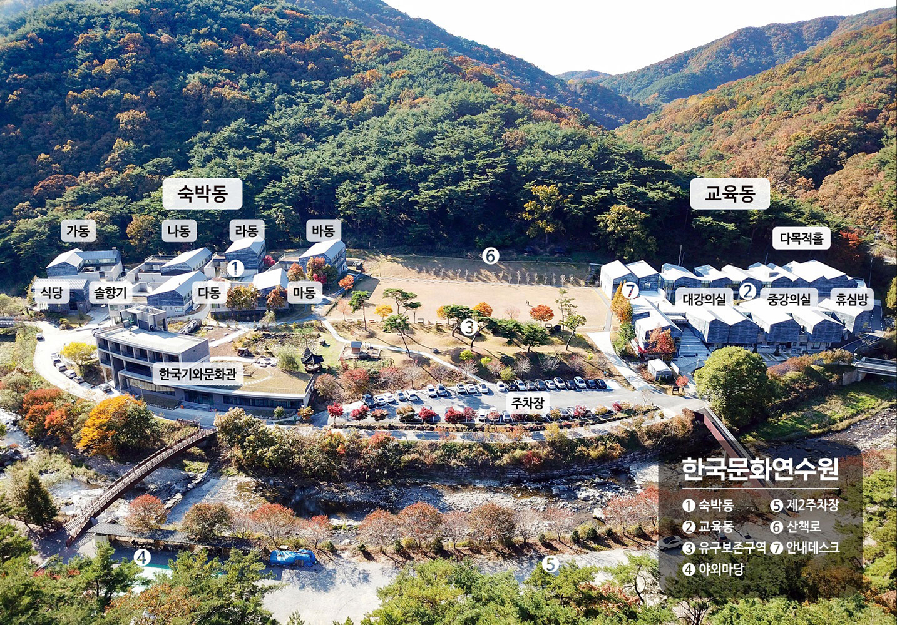
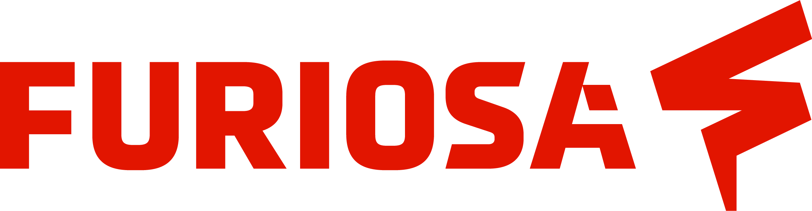
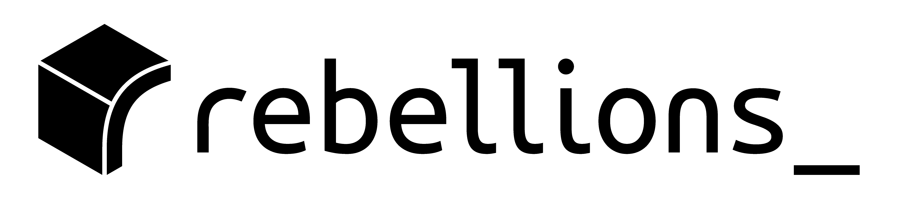
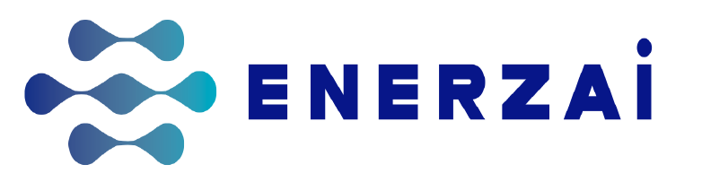
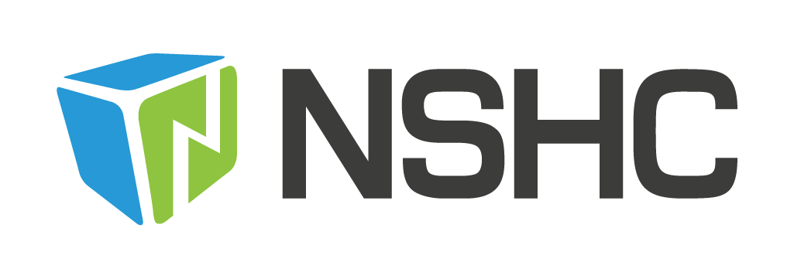

<h1>

한국정보과학회 프로그래밍언어연구회 여름학교
  (SIGPL Summer School 2026)

</h1>

<table><tbody><tr><th align="left">
<ul>
<li>
    일시: 2026년 8월 26일 (수) ~ 2026년 8월 28일 (금)
</li><li>
    장소: 공주 한국문화연수원 (<a href="https://www.budcc.com/main.php">홈페이지</a>)
</li><li>
    주최: 한국정보과학회 프로그래밍언어연구회
</li><li>
    후원: 리벨리온
</li>
</ul>
</th></tr></tbody></table>

<h2>초대의 글</h2>

한국정보과학회 프로그래밍언어연구회에서 주최하는 2026 여름학교로 여러분을 초대합니다.

이번 여름학교에서는 국내외 학계 및 산업계의 전문가분들을 모시고, 'AI를 활용한 프로그래밍 언어(PL) 연구'와 'AI 시대에 PL 연구가 나아갈 방향'에 대해 심도 있게 논의하는 자리를 마련했습니다.
또한 예년과 마찬가지로 국내 주요 연구실의 최신 연구를 직접 살펴볼 수 있는 포스터 세션을 비롯해, PL 분야 교수님들의 진솔한 경험담과 조언을 들을 수 있는 특별한 시간도 준비되어 있습니다.
여러분의 많은 관심과 참여를 부탁드립니다.

한국정보과학회 프로그래밍언어연구회  
운영위원장 <a href="https://psl.hanyang.ac.kr/">이성호</a> (충남대학교)

2026 프로그래밍언어연구회 여름학교 
조직위원장 김지응 (연세대학교) 
프로그램위원장 고상기 (서울시립대학교)

<h2>프로그램</h2>

<ul>
  <li>
    <table border="0" cellspacing="0">
      <tbody>
        <tr>
          <td bgcolor="#cccccc">
            <table border="0" cellspacing="1pt">
              <tbody>
                <tr><th colspan="3" align="left"> 8월 26일 (수요일) </th></tr>
                <tr>
                  <td bgcolor="white"> 13:30 ~ 15:00 </td> 
                  <td bgcolor="white"> 등록 </td>
                  <td bgcolor="white"> TBA </td>
                </tr>
                <tr>
                  <td bgcolor="white"> 15:00 ~ 18:00 </td> 
                  <td bgcolor="white"> TBD </td> 
                  <td bgcolor="white"> TBA </td>
                </tr>  
                <tr>
                  <td bgcolor="white"> 18:00 ~ 20:00 </td> 
                  <td bgcolor="white"> 석식 </td>
                  <td bgcolor="white"> TBA </td>
                </tr>  
                <tr>
                  <td bgcolor="white"> 20:00 ~ 22:00 </td> 
                  <td bgcolor="white"> 포스터 세션 </td>
                  <td bgcolor="white"> TBA </td>
                </tr>  

                <tr><th colspan="3" align="left"> 8월 27일 (목요일) </th></tr>
                <tr>
                  <td bgcolor="white"> 7:30 ~ 8:30 </td> 
                  <td bgcolor="white"> 조식 </td>
                  <td bgcolor="white"> TBA </td>
                </tr>  
                <tr>
                  <td bgcolor="white"> 9:00 ~ 12:00 </td> 
                  <td bgcolor="white"> TBD </td>
                  <td bgcolor="white"> TBA </td>
                </tr>  
                <tr>
                  <td bgcolor="white"> 12:00 ~ 13:00 </td> 
                  <td bgcolor="white"> 중식 </td>
                  <td bgcolor="white"> TBA </td>
                </tr>  
                <tr>
                  <td bgcolor="white"> 13:00 ~ 16:00 </td> 
                  <td bgcolor="white"> <a href="http://www.magoksa.or.kr/?asdf=home">마곡사</a> 투어 </td>
                  <td bgcolor="white"> 개별 </td>
                </tr>  
                <tr>
                  <td bgcolor="white"> 16:00 ~ 18:00 </td> 
                  <td bgcolor="white"> 후원사 발표 </td>
                  <td bgcolor="white"> TBA </td>
                </tr>  
                <tr>
                  <td bgcolor="white"> 18:00 ~ 20:00 </td> 
                  <td bgcolor="white"> 석식 </td>
                  <td bgcolor="white"> TBA </td>
                </tr>  
                <tr>
                  <td bgcolor="white"> 20:00 ~ 22:00 </td> 
                  <td bgcolor="white"> 단체 프로그램 </td>
                  <td bgcolor="white"> TBA </td>
                </tr>  

                <tr><th colspan="3" align="left"> 8월 28일 (금요일) </th></tr>
                <tr>
                  <td bgcolor="white"> 7:30 ~ 8:30 </td> 
                  <td bgcolor="white"> 조식 </td>
                  <td bgcolor="white"> TBA </td>
                </tr>  
                <tr>
                  <td bgcolor="white"> 9:00 ~ 11:30 </td> 
                  <td bgcolor="white"> TBD </td>
                  <td bgcolor="white"> TBA </td>
                </tr> 
              </tbody>
            </table>
          </td>
        </tr>
      </tbody>
    </table>
  </li>
</ul>

<h2>등록</h2>

<ul>
  <li><b>1차 사전 등록 마감: 2026년 7월 31일(금요일)</b></li>
  <li>2차 사전 등록 마감: 2026년 8월 14일(금요일)</li>
  <li> 등록 방법: <a href="https://www.kiise.or.kr/" target="_blank">등록 페이지</a>를 통해 신청 가능합니다. 행사 장소의 특성상 등록비에는 숙박비가 포함되어 있습니다. 일반 등록자들에게는 1인 1실을 제공하고자 하며, 학생 등록자들은 성별/연구실/학교 순으로 매칭하여 3인 1실~6인 1실을 제공할 예정입니다. 원활한 배정을 위하여 모든 참석자분들은 아래 구글 폼을 필수로 작성해 주세요.  
  일반 등록자들은 "현장 등록"은 가능하지만, 행사 장소의 특성상 숙박 제공을 해드리지 못합니다. 사전 등록을 못 하실 경우 주변 숙소를 이용하셔야 하며, 일정상 사전 등록이 힘드실 경우 조직위원장에게 이메일로 연락 부탁드립니다. 또한, 등록 시 일반 등록/학생 등록 구분에 따라 아래 구글 폼을 필수로 작성 부탁드립니다. 연수원 숙박과 관련된 "숙박 안내" 유의 사항도 꼼꼼히 읽어주시기 바랍니다.  
  <table border="1" bordercolor="#a0a0a0" cellspacing="0">
  <tbody><tr><th>&nbsp;</th><th>학생</th><th>일반</th></tr>
  <tr align="center"><th>1차 사전 등록 (~2026.07.31) </th><td>270,000원</td><td> 470,000원 </td></tr>
  <tr align="center"><th>2차 사전 등록 (~2026.08.14) </th><td>320,000원</td><td> 570,000원 </td></tr>
  <tr align="center"><th>현장 등록 </th><td> - </td><td>300,000원</td></tr>
  <tr align="center"><th>특별 할인 </th><td>80,000원</td><td> - </td></tr>
  </tbody></table>
     
  </li>  
  <li> <b>참석 정보 작성 서류 (필히 작성 부탁 드립니다.)</b>
    <li><a href="https://docs.google.com/forms/d/e/1FAIpQLSewbXFQVxKoqzUJeTzHw6Ck1MxorSVdK7SwKwlrUBaup8N21A/viewform?usp=dialog" target="_blank">일반 등록자 참석 정보 작성 구글 폼</a></li>
    <li><a href="https://docs.google.com/forms/d/e/1FAIpQLScuHM3o-2Z8QVfi1ZArncje7C_K_5kQfXpRkXESm0l9Ao9WOw/viewform?usp=dialog" target="_blank">학생 등록자 (특별할인 포함) 참석 정보 작성 구글 폼</a></li>
 </li>  
  <li>
    <b>특별 할인</b>
    <ul>
        <li>
        올해에도 "특별 할인"을 통해 연구비가 부족한 경우에 지원하고자 합니다. 지원을 위해서는 지도교수 추천서가 필요합니다. 더 다양한 학생들에게 기회를 드리고자, 지도교수당 최대 3명까지만 추천을 받습니다. 특별 할인의 경우에도 숙박 제공 금액을 추가하여 80,000원으로 책정하였습니다.         
        - 지원 마감: 2026년 7월 17일(금) 
        - <a href="https://docs.google.com/forms/d/e/1FAIpQLSes2jFZhpWXEsFiQBpOQjFuW_FxiizX6VfOYx3MonwP16pHmQ/viewform?usp=dialog" target="_blank">구글 폼</a>을 통해 지원해 주시면 승인 시 메일에 결제 링크가 포함되어 전달됩니다. 
        - 결제 진행: <a href="https://www.kiise.or.kr/" target="_blank">등록 페이지</a>에서 동일하게 정보를 작성하고 참가 신청 결제 시 <strong>'계좌이체'</strong>를 선택한 뒤, 입금 메모에 <strong>"특별할인"</strong>을 기재해 주세요.
        </li>
    </ul>
  </li>
  <li><b>유의 사항</b>
      <ul>
          <li>계절학교에서 제공되는 식사는 수요일 저녁, 목요일 아침/점심/저녁, 금요일 아침입니다.</li>
          <li>이번 계절학교부터는 환경 보호를 위해 개인 명찰을 일괄 배부하지 않습니다. 그러므로 되도록 개인 명찰(지난 계절학교 명찰, 혹은 다른 학회 명찰 등)을 지참해 주시기를 바랍니다. 개인 명찰이 없으신 분들에 한해 현장에서 명찰을 제공해 드립니다.</li>
          <li>이번 계절학교에서는 두 개의 단체 프로그램이 마련되어 있습니다: 1) 마곡사 나들이 2) 전통 문화 체험. 전통 문화 체험은 수업별로 인원수가 제한되어 있으니 구글 폼을 통해 필수로 선호도를 응답해 주세요.</li>
          <li>참가확인서가 필요한 분들은 행사 종료 후 한국정보과학회(담당: <a href="mailto:dareum89@kiise.or.kr">오다름 대리</a>)에 이메일로 요청해 주십시오.</li>
      </ul>
  </li>
</ul>

<!--<h2>포스터 발표 신청</h2>-->
<!--<ul>-->
<!--  <li>-->
<!--  <a href="https://docs.google.com/forms/d/e/1FAIpQLSci1vDwfJyWNx-0TNVogtSr8wVV1QFDXM3OnpN6DubkyFlBLg/viewform?usp=header" target="_blank">-->
<!--  포스터 신청 구글폼</a>을 통해 8월 11일(월요일)까지 신청해 주시기 바랍니다.-->
<!--  </li>-->
<!--</ul>-->

<h2>오시는 길 및 숙박 안내</h2>

  

<ul>
  <li> 행사 장소: <a href="https://www.budcc.com/main.php" target="_blank">한국문화연수원 (공주)</a></li>
  <li>
    본 행사가 진행되는 "한국문화연수원"은 개인 예약이 어렵습니다. 따라서 운영진이 방 배정을 진행할 예정입니다. 아래 유의 사항을 참고해 주시기 바라며, 문의 사항은 아래 이메일로 연락 부탁드립니다.
    <ul>
      <li><strong>숙박 시설 사진:</strong> <a href="https://www.budcc.com/doc/fac01.php" target="_blank">확인하기 (클릭)</a></li>
      <li><strong>구비 시설 및 물품:</strong> 침구류, TV, 에어컨, 수건, 헤어드라이어, 샴푸, 바디워시, 치약, 비누, 화장실</li>
      <li><strong>필수 준비 품목:</strong> 칫솔, 텀블러 등 개인 물품 (생수와 칫솔은 비치되어 있지 않습니다.)</li>
      <li><strong>기타 유의 사항:</strong> 
        - 분리수거는 라동 앞 분리수거장을 이용해 주시기 바랍니다. 
        - 객실 내에서의 흡연 및 취사는 엄격히 금지되어 있습니다. 
        - 연수원 객실에는 수건(3인실 4장, 4인실 5장, 6인실 8장)이 비치되어 있습니다. 2박 이상 이용 시 사용하신 수건을 신발장 위에 올려두시면 14~15시 사이에 교체해 드립니다. 
        - 생수는 비치되어 있지 않으므로 식당 앞 휴게실 정수기를 이용해 주시기 바랍니다. 
        - 객실 내 음주는 가능하나, 퇴실 시 분리수거를 철저히 해 주시기 바랍니다.
      </li> 
      <li><strong>문의 이메일:</strong> <a href="mailto:jieungkim@yonsei.ac.kr">jieungkim@yonsei.ac.kr</a> (메일 제목에 <strong>[SIGPL2026여름학교 - 숙박]</strong> 말머리를 기재해 주시기 바랍니다.)</li>
    </ul>
  </li>
  <li>숙박이 제공되지 않는 경우, 근처 호텔에 개별적으로 예약해 주시기 바랍니다.</li>
</ul>

<h2>후원 모집</h2>
2026 SIGPL 겨울학교 후원 기업을 모집하고 있습니다.
후원에 관심이 있으신 기업에서는 조직위원장 <a href="mailto:jieungkim@yonsei.ac.kr">김지응 교수</a>에게 이메일로 문의해주시면 후원 혜택을 안내해드립니다.

<h2>후원사 소개</h2>
<ul>
  <table border="0" cellspacing="0">
  <tbody><tr><td bgcolor="#cccccc">
  <table border="0" cellspacing="1pt">
<tbody>
  <tr><th colspan="2" align="left"> 골드 후원사</th></tr>
  <!-- <tr>
    <td bgcolor="white"></td>
    <td bgcolor="white" style="width:800">
FuriosaAI는 대한민국을 대표하는 인공지능 반도체 기업으로서 이재명 정부 1호 유니콘 기업이 되었습니다.
대규모 언어모델(LLM)을 고효율로 가속할 수 있는 2세대 AI 반도체 RNGD의 양산을 앞두고 있습니다.
Meta, OpenAI, LG AI Research, UpstageAI, Aramco 등 세계 유수 기업들이 관심을 보일 정도로 높은 기술력과 인지도를 인정받으며,
글로벌 AI 반도체 시장에서 혁신을 주도하는 기업으로 자리매김하고 있습니다.
    </td>
  </tr> -->
  <tr>
    <td bgcolor="white"></td>
    <td bgcolor="white" style="width:800">
리벨리온은 AI가속기, 컴파일러, vLLM 기반의 오픈소스 SW를 개발하는 스타트업입니다. 2025년 10월 기준으로MIT, Harvard, Stanford등 총 75명 이상의 박사들과 구글, 엔비디아, 메타 등 총 50명 이상의 해외 빅테크 출신들로 구성된 250명 규모의 개발자들로 구성되어 있습니다. 주력제품인 R100은 블랙웰 수준의 추론성능을 보다 뛰어난 전력 효율로 구현하였으며, 현재 일론 머스크의 xAI, 미국 투자은행 JP Morgan 등과 상용화를 진행하고 있습니다. 또한 Red Hat의 유일한 스타트업 공식 파트너로서, 오픈소스 SW를 통해 사우디의 소버린AI 데이터센터를 구축하고 있습니다.
    </td>
  </tr>
  <!-- <tr><th colspan="2" align="left"> 실버 후원사</th></tr>
    <td bgcolor="white"></td>
    <td bgcolor="white" style="width:800">
    에너자이(ENERZAi)는 모델 디자인에서 양자화와 그래프 최적화, 커널 단위 컴파일 최적화에 이르기까지 전 과정을 포괄하는 풀스택 Edge AI 소프트웨어 솔루션을 제공합니다. 개별 Edge 하드웨어에 맞춰 모델을 극한까지 최적화된 머신 코드로 변환하는 추론 최적화 엔진 Optimium과 MLIR 기반 프로그래밍 언어 Nadya를 개발했으며, 이러한 기술을 바탕으로 1.58-bit 초경량 음성 인식 모델을 대규모 상용 환경에 성공적으로 배포했습니다. 에너자이는 ARM, Synaptics, Advantech 등 글로벌 파트너들과 함께 다양한 Edge 환경에서 AI의 성능과 효율을 확장해 나가고 있습니다.
    </td> -->
  <!-- <tr><th colspan="2" align="left"> 브론즈 후원사</th></tr>
  <tr>
    <td bgcolor="white"></td>
    <td bgcolor="white" style="width:800">
2004년 해커들의 모임으로 시작된 NSHC는 2008년 법인 설립 후, 국내는 물론 싱가포르와 일본 등의 해외 지사를 기반으로
아시아 최고의 정보보안 기업을 목표로 보안 컨설팅, 모바일 보안 솔루션 개발, 악성코드 분석 및 취약점 정보 제공(ISAC)에
집중하고 있는 정보보안 벤처기업입니다. 모바일 보안 솔루션 시장에서는 점유율 1위를 차지하고 있으며, 국내 약 180개의
스마트폰 금융 애플리케이션에 제품을 공급하고 있고, 2025년 기준 94명의 임직원과 함께 연매출 127억을 달성하고 있습니다.
2017년 LLVM 4.0 기반 난독화 솔루션 개발을 시작으로, 최신 버전의 LLVM까지 Swift 지원을 포함한 안정적인 업데이트와 기술
지원을 성공적으로 이어오고 있으며, 2022년에는 그동안 축적된 기술력을 바탕으로 LLVM 연구소를 설립해 컴파일러 기반 보안 솔루션을
OT·국방등 다양한 분야에 적용하려는 한편, Edge AI 플랫폼과 정형검증등의 연구개발에도 집중하고 있습니다
    </td>
  </tr> -->
</tbody>
  </table></td></tr></tbody></table>
</ul>
