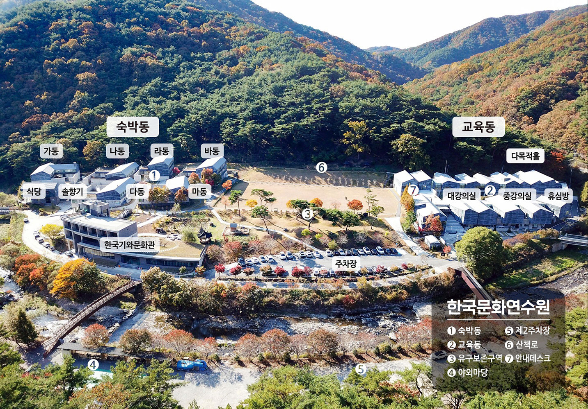
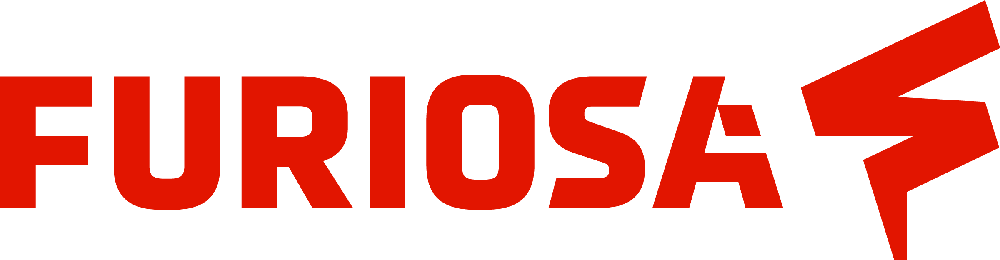
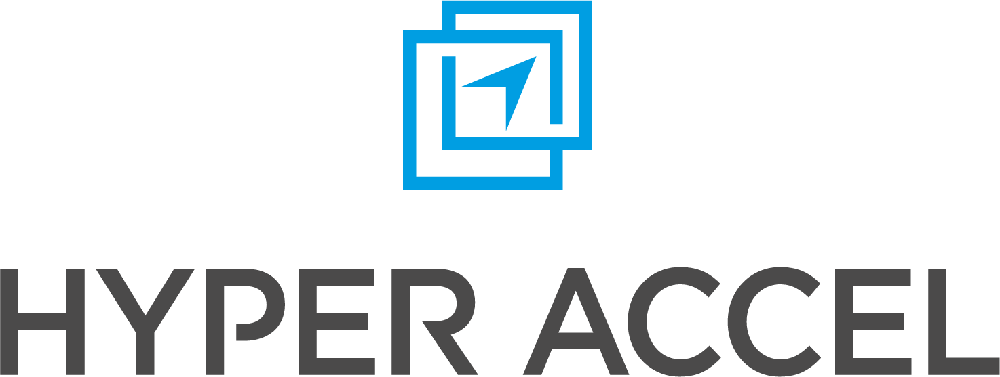
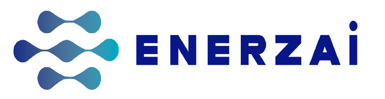
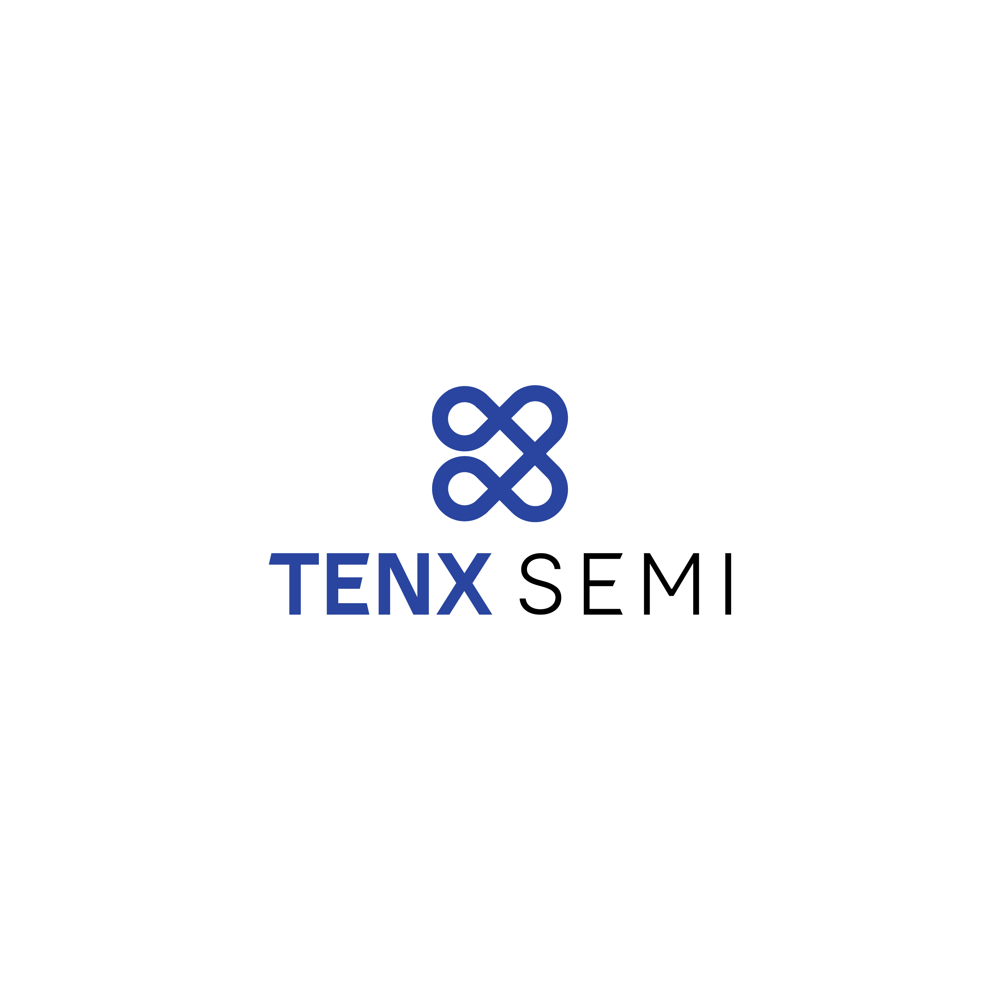
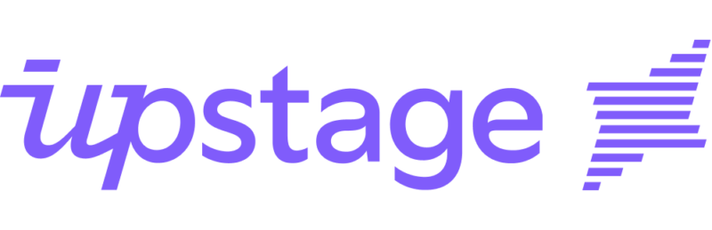

<h1>

한국정보과학회 프로그래밍언어연구회 여름학교
  (SIGPL Summer School 2026)

</h1>

<table><tbody><tr><th align="left">
<ul>
<li>
    일시: 2026년 8월 26일 (수) ~ 2026년 8월 28일 (금)
</li><li>
    장소: 공주 한국문화연수원 (<a href="https://www.budcc.com/main.php">홈페이지</a>)
</li><li>
    주최: 한국정보과학회 프로그래밍언어연구회
</li><li>
    후원: FuriosaAI, 리벨리온, 하이퍼엑셀, TenX, Upstage
</li>
</ul>
</th></tr></tbody></table>

<h2>초대의 글</h2>

한국정보과학회 프로그래밍언어연구회에서 주최하는 2026 여름학교로 여러분을 초대합니다.

이번 여름학교에서는 국내외 학계 및 산업계의 전문가분들을 모시고, 'AI를 활용한 프로그래밍 언어(PL) 연구'와 'AI 시대에 PL 연구가 나아갈 방향'에 대해 심도 있게 논의하는 자리를 마련했습니다.
또한 예년과 마찬가지로 국내 주요 연구실의 최신 연구를 직접 살펴볼 수 있는 포스터 세션을 비롯해, PL 분야 교수님들의 진솔한 경험담과 조언을 들을 수 있는 특별한 시간도 준비되어 있습니다.
여러분의 많은 관심과 참여를 부탁드립니다.

한국정보과학회 프로그래밍언어연구회  
운영위원장 <a href="https://psl.hanyang.ac.kr/">이성호</a> (충남대학교)

2026 프로그래밍언어연구회 여름학교 
조직위원장 김지응 (연세대학교) 
프로그램위원장 고상기 (서울시립대학교)

<h2>프로그램</h2>
<table border="0" cellspacing="0">
      <tbody>
        <tr>
          <td bgcolor="#cccccc">
            <table border="0" cellspacing="1pt">
              <tbody>
                <tr><th colspan="3" align="left"> 8월 26일 (수요일) </th></tr>
                <tr>
                  <td bgcolor="white"> 12:00 ~ 14:00 </td>
                  <td bgcolor="white"> 도착 </td>
                  <td bgcolor="white"> 개별 </td>
                </tr>
                <tr>
                  <td bgcolor="white"> 14:00 ~ 14:30 </td>
                  <td bgcolor="white"> 등록 </td>
                  <td bgcolor="white"> 연수원 로비 </td>
                </tr>
                <tr>
                  <td bgcolor="white"> 14:30 ~ 14:40 </td>
                  <td bgcolor="white"> 개회식 </td>
                  <td bgcolor="white"> 이성호 교수 (SIGPL 위원장) 김지응 교수 (여름학교 운영위원장) </td>
                </tr>
                <tr>
                  <td bgcolor="white"> 14:50 ~ 15:50 </td>
                  <td bgcolor="white"> 초청강연 I </td>
                  <td bgcolor="white"> 허충길 교수 (서울대학교) AI와 프로그램 검증의 만남 </td>
                </tr>
                <tr>
                  <td bgcolor="white"> 16:00 ~ 17:00 </td>
                  <td bgcolor="white"> 초청강연 II </td>
                  <td bgcolor="white"> 허기홍 교수 (KAIST) 논리와 직관이 융합된 검증형 AI로 만들어 갈 미래 </td>
                </tr>
                <tr>
                  <td bgcolor="white"> 17:00 ~ 18:00 </td>
                  <td bgcolor="white"> 번개 발표 세션 </td>
                  <td bgcolor="white"> 번개 발표 (1인 5분) </td>
                </tr>
                <tr>
                  <td bgcolor="white"> 18:00 ~ 20:00 </td>
                  <td bgcolor="white"> 환영 만찬 </td>
                  <td bgcolor="white"> - </td>
                </tr>
                <tr>
                  <td bgcolor="white"> 20:00 ~ 22:00 </td>
                  <td bgcolor="white"> 포스터 세션 </td>
                  <td bgcolor="white"> 포스터 발표 및 우수 포스터 심사 </td>
                </tr>

                <tr><th colspan="3" align="left"> 8월 27일 (목요일) </th></tr>
                <tr>
                  <td bgcolor="white"> 07:30 ~ 08:30 </td>
                  <td bgcolor="white"> 조식 </td>
                  <td bgcolor="white"> - </td>
                </tr>
                <tr>
                  <td bgcolor="white"> 09:00 ~ 09:55 </td>
                  <td bgcolor="white"> 초청강연 III </td>
                  <td bgcolor="white"> 김윤승 교수 (DGIST) 컴퓨터 증명으로 AI의 실속만 챙기기 — 더 빠르고, 더 안전한 실시간 시스템을 향해 </td>
                </tr>
                <tr>
                  <td bgcolor="white"> 10:10 ~ 11:05 </td>
                  <td bgcolor="white"> 초청강연 IV </td>
                  <td bgcolor="white"> 홍신 교수 (충북대학교) AI를 활용한 테스트 입력 합성 </td>
                </tr>
                <tr>
                  <td bgcolor="white"> 11:15 ~ 12:00 </td>
                  <td bgcolor="white"> 초청강연 V </td>
                  <td bgcolor="white"> 정대룡 교수 (서울대학교) 계층 간 명세 불일치로 인한 보안 결함: 커널-하드웨어 경계의 두 가지 사례 연구 </td>
                </tr>
                <tr>
                  <td bgcolor="white"> 12:00 ~ 13:00 </td>
                  <td bgcolor="white"> 중식 </td>
                  <td bgcolor="white"> - </td>
                </tr>
                <tr>
                  <td bgcolor="white"> 13:00 ~ 16:00 </td>
                  <td bgcolor="white"> <a href="http://www.magoksa.or.kr/?asdf=home">마곡사</a> 문화 투어 </td>
                  <td bgcolor="white"> 백제권 천년고찰 (도보 이동) </td>
                </tr>
                <tr>
                  <td bgcolor="white"> 16:00 ~ 18:00 </td>
                  <td bgcolor="white"> 후원 기업 발표 </td>
                  <td bgcolor="white"> FuriosaAI · 리벨리온 · 하이퍼엑셀 · TenX Semi · Upstage </td>
                </tr>
                <tr>
                  <td bgcolor="white"> 18:00 ~ 20:00 </td>
                  <td bgcolor="white"> 만찬 </td>
                  <td bgcolor="white"> - </td>
                </tr>
                <tr>
                  <td bgcolor="white"> 20:00 ~ 22:00 </td>
                  <td bgcolor="white"> 단체 프로그램 또는 자유 시간 </td>
                  <td bgcolor="white"> 한국문화연수원 자체 프로그램 (다도 · 명상 등) </td>
                </tr>

                <tr><th colspan="3" align="left"> 8월 28일 (금요일) </th></tr>
                <tr>
                  <td bgcolor="white"> 07:30 ~ 08:30 </td>
                  <td bgcolor="white"> 조식 · 퇴실 준비 </td>
                  <td bgcolor="white"> - </td>
                </tr>
                <tr>
                  <td bgcolor="white"> 09:00 ~ 10:00 </td>
                  <td bgcolor="white"> 미해결 문제 세션 </td>
                  <td bgcolor="white"> 미해결 문제 발제 및 그룹 토의 </td>
                </tr>
                <tr>
                  <td bgcolor="white"> 10:15 ~ 11:00 </td>
                  <td bgcolor="white"> 패널 토의 </td>
                  <td bgcolor="white"> 신뢰 가능한 AI를 위한 PL&amp;SE 연구 어젠다 </td>
                </tr>
                <tr>
                  <td bgcolor="white"> 11:00 ~ 11:30 </td>
                  <td bgcolor="white"> 우수 포스터 시상식 · 폐회식 </td>
                  <td bgcolor="white"> - </td>
                </tr>
                <tr>
                  <td bgcolor="white"> 12:00 ~ </td>
                  <td bgcolor="white"> 해산 </td>
                  <td bgcolor="white"> - </td>
                </tr>
              </tbody>
            </table>
          </td>
        </tr>
      </tbody>
</table>

<h2>발표 프로그램</h2>

현재까지 포스터 <b>52편</b>, 번개 발표 <b>13편</b>, 미해결 문제 발제 <b>1편</b>이 접수되었습니다.
신청해 주신 모든 분께 감사드립니다.

<b>추가 신청도 계속 받고 있습니다.</b> 아래 구글폼으로 신청해 주시면 프로그램에 반영해 드립니다.

<ul>
  <li><b>신청 링크:</b> <a href="https://docs.google.com/forms/d/e/1FAIpQLSetBnQx2C-Jzce3ZcrAB55XkRfdC169qIwFwI9L_HWzVH5UPQ/viewform" target="_blank">발표 신청 구글폼</a></li>
</ul>

<h3>포스터 발표 (8월 26일 수요일 20:00~22:00)</h3>

발표자는 저자 목록에서 <b>*</b>로 표시했습니다. 우수 포스터는 심사를 거쳐 폐회식(8/28)에서 시상합니다.

<table border="0" cellspacing="0">
  <tbody><tr><td bgcolor="#cccccc">
  <table border="0" cellspacing="1pt">
  <tbody>
    <tr><th bgcolor="#eeeeee" width="30">#</th><th bgcolor="#eeeeee" align="left">제목</th><th bgcolor="#eeeeee" align="left">저자</th><th bgcolor="#eeeeee" align="left">소속</th></tr>
    <tr>
      <td bgcolor="white" align="center"> 1 </td>
      <td bgcolor="white"> 더 정밀하고 똑똑한 지향성 퍼징 맞춤형 값 덮이 </td>
      <td bgcolor="white"> 김태은*, 최재승, 허기홍, 차상길 </td>
      <td bgcolor="white"> KAIST 프로그래밍시스템연구실 </td>
    </tr>
    <tr>
      <td bgcolor="white" align="center"> 2 </td>
      <td bgcolor="white"> 하나를 보면 열을 아는 뉴로심볼릭 코드 모델 학습 </td>
      <td bgcolor="white"> 류연희 </td>
      <td bgcolor="white"> KAIST 허기홍 교수 연구실 </td>
    </tr>
    <tr>
      <td bgcolor="white" align="center"> 3 </td>
      <td bgcolor="white"> 마크다운 좀 그만 씁시다 </td>
      <td bgcolor="white"> 이동재, 정승현*, 허기홍 </td>
      <td bgcolor="white"> KAIST 프로그래밍시스템연구실 </td>
    </tr>
    <tr>
      <td bgcolor="white" align="center"> 4 </td>
      <td bgcolor="white"> 검증된 프로그램 만들어줘 </td>
      <td bgcolor="white"> 이동재*, 허기홍 </td>
      <td bgcolor="white"> KAIST ProsysLab </td>
    </tr>
    <tr>
      <td bgcolor="white" align="center"> 5 </td>
      <td bgcolor="white"> 확률적 프로그래밍을 통한 쉽고 효율적인 양자 사후 추론 </td>
      <td bgcolor="white"> 전승민*, 류석영 </td>
      <td bgcolor="white"> KAIST PLRG </td>
    </tr>
    <tr>
      <td bgcolor="white" align="center"> 6 </td>
      <td bgcolor="white"> 실행 요약 의미 기반 오류 유발 단위 테스트 케이스 생성 </td>
      <td bgcolor="white"> 장수진*, 류연희 </td>
      <td bgcolor="white"> KAIST 프로그래밍시스템연구실 </td>
    </tr>
    <tr>
      <td bgcolor="white" align="center"> 7 </td>
      <td bgcolor="white"> 우리 Rust 월클 맞습니다 </td>
      <td bgcolor="white"> 김현빈*, 장봉준*, 허기홍 </td>
      <td bgcolor="white"> KAIST 프로그래밍시스템연구실 </td>
    </tr>
    <tr>
      <td bgcolor="white" align="center"> 8 </td>
      <td bgcolor="white"> 자바스크립트 트랜스파일러의 스코프 관련 버그 탐지 </td>
      <td bgcolor="white"> 고성민*, 연현중 </td>
      <td bgcolor="white"> 고려대 프로그래밍언어연구실 </td>
    </tr>
    <tr>
      <td bgcolor="white" align="center"> 9 </td>
      <td bgcolor="white"> 자바스크립트 언어 명세의 구조 타입 추론을 통한 일치성 검사 테스트 합성 연구 </td>
      <td bgcolor="white"> 김현준*, 이무궁 </td>
      <td bgcolor="white"> 고려대 프로그래밍언어연구실 </td>
    </tr>
    <tr>
      <td bgcolor="white" align="center"> 10 </td>
      <td bgcolor="white"> 최신 자바스크립트를 위한 명세 기반 자동화된 그림자 실행(Shadow Execution) </td>
      <td bgcolor="white"> 최민석*, J. Pereira, 박성민, R. Gonçalves, L. Jia, 박지혁 </td>
      <td bgcolor="white"> 고려대 프로그래밍언어연구실 </td>
    </tr>
    <tr>
      <td bgcolor="white" align="center"> 11 </td>
      <td bgcolor="white"> MiniPoly: 언어 명세에서 효율적인 자바스크립트 폴리필 자동 추출하기 </td>
      <td bgcolor="white"> 김정웅*, 조영민* </td>
      <td bgcolor="white"> 고려대 프로그래밍언어연구실 </td>
    </tr>
    <tr>
      <td bgcolor="white" align="center"> 12 </td>
      <td bgcolor="white"> 자바스크립트 기계화 명세로부터 증명언어 표현 자동 변환하기 </td>
      <td bgcolor="white"> 최민석*, 하준서*, 박지혁 </td>
      <td bgcolor="white"> 고려대 프로그래밍언어연구실 </td>
    </tr>
    <tr>
      <td bgcolor="white" align="center"> 13 </td>
      <td bgcolor="white"> 검증된 코드 생성을 위한 세밀한 증명 실패 대응 </td>
      <td bgcolor="white"> 신지호*, 오원석, 오학주 </td>
      <td bgcolor="white"> 고려대 소프트웨어분석연구실 </td>
    </tr>
    <tr>
      <td bgcolor="white" align="center"> 14 </td>
      <td bgcolor="white"> 파이썬 공식 구현체의 동시성 버그 찾기 </td>
      <td bgcolor="white"> 신해소진*, 변지석, 오학주 </td>
      <td bgcolor="white"> 고려대 소프트웨어분석연구실 </td>
    </tr>
    <tr>
      <td bgcolor="white" align="center"> 15 </td>
      <td bgcolor="white"> 광역과 정밀 탐색 제대로 같이 쓰는 방법 </td>
      <td bgcolor="white"> 안주영*, 오학주, 최재승, 차수영 </td>
      <td bgcolor="white"> 고려대 소프트웨어분석연구실 </td>
    </tr>
    <tr>
      <td bgcolor="white" align="center"> 16 </td>
      <td bgcolor="white"> 목표 지점과 관련된 코드를 정확히 찾아 지향성 퍼징 개선하기 </td>
      <td bgcolor="white"> 허준용*, 오학주 </td>
      <td bgcolor="white"> 고려대 소프트웨어분석연구실 </td>
    </tr>
    <tr>
      <td bgcolor="white" align="center"> 17 </td>
      <td bgcolor="white"> 효과적인 프로그램 동등성 증명기 만들기 </td>
      <td bgcolor="white"> 조민규*, 이석현, 오학주 </td>
      <td bgcolor="white"> 고려대 소프트웨어분석연구실 </td>
    </tr>
    <tr>
      <td bgcolor="white" align="center"> 18 </td>
      <td bgcolor="white"> Fold and Unfold Annotation Synthesis for Separation-Logic-Based Verification </td>
      <td bgcolor="white"> 이중훈 </td>
      <td bgcolor="white"> 고려대 소프트웨어분석연구실 </td>
    </tr>
    <tr>
      <td bgcolor="white" align="center"> 19 </td>
      <td bgcolor="white"> MCP 서버에 있는 버그 찾기 </td>
      <td bgcolor="white"> 임지민*, 오원석, 안가빈, 오학주 </td>
      <td bgcolor="white"> 고려대 소프트웨어분석연구실 </td>
    </tr>
    <tr>
      <td bgcolor="white" align="center"> 20 </td>
      <td bgcolor="white"> VeriPy: 파이썬 정적검증기 </td>
      <td bgcolor="white"> 이석호*, 송도원, 오학주 </td>
      <td bgcolor="white"> 고려대 소프트웨어분석연구실 </td>
    </tr>
    <tr>
      <td bgcolor="white" align="center"> 21 </td>
      <td bgcolor="white"> 스펙트럼 조절을 통한 유니터리 행렬 양자회로 합성 </td>
      <td bgcolor="white"> 강찬구*, 오학주 </td>
      <td bgcolor="white"> 고려대 소프트웨어분석연구실 </td>
    </tr>
    <tr>
      <td bgcolor="white" align="center"> 22 </td>
      <td bgcolor="white"> 축적된 작업 경험을 활용한 코딩 에이전트 효율 개선 </td>
      <td bgcolor="white"> 김민수*, 오학주 </td>
      <td bgcolor="white"> 고려대 소프트웨어분석연구실 </td>
    </tr>
    <tr>
      <td bgcolor="white" align="center"> 23 </td>
      <td bgcolor="white"> 컴파일 전 오염 추적으로 컴파일된 프로그램의 GNI 증명하기 </td>
      <td bgcolor="white"> 남연우*, 김용희, 심우진 </td>
      <td bgcolor="white"> 서울대 소프트웨어원리연구실 </td>
    </tr>
    <tr>
      <td bgcolor="white" align="center"> 24 </td>
      <td bgcolor="white"> 분산시스템 처음부터 끝까지 검증하기 </td>
      <td bgcolor="white"> 이상현* </td>
      <td bgcolor="white"> 서울대 소프트웨어원리연구실 </td>
    </tr>
    <tr>
      <td bgcolor="white" align="center"> 25 </td>
      <td bgcolor="white"> 예언할 수 있게 스펙 길들이기 </td>
      <td bgcolor="white"> 윤태영*, 허충길 </td>
      <td bgcolor="white"> 서울대 소프트웨어원리연구실 </td>
    </tr>
    <tr>
      <td bgcolor="white" align="center"> 26 </td>
      <td bgcolor="white"> 잘게 나눠 기억해두어 알뜰하게 실행하기 </td>
      <td bgcolor="white"> 서장협* </td>
      <td bgcolor="white"> 서울대 프로그래밍연구실 </td>
    </tr>
    <tr>
      <td bgcolor="white" align="center"> 27 </td>
      <td bgcolor="white"> 분석기 재활용: 기존 언어 분석기로 정확한 새 언어 분석기 만들기 </td>
      <td bgcolor="white"> 안중원*, 이재호, 오규혁, 박지혁, 이광근 </td>
      <td bgcolor="white"> 서울대 프로그래밍연구실 </td>
    </tr>
    <tr>
      <td bgcolor="white" align="center"> 28 </td>
      <td bgcolor="white"> 끼어들기(Interrupt)를 고려한 인덱스 분석 </td>
      <td bgcolor="white"> 유형서 </td>
      <td bgcolor="white"> 서울대 프로그래밍연구실 </td>
    </tr>
    <tr>
      <td bgcolor="white" align="center"> 29 </td>
      <td bgcolor="white"> AI를 활용한 안전한 정적 분석기 생성 </td>
      <td bgcolor="white"> 신채환*, 이광근 </td>
      <td bgcolor="white"> 서울대 프로그래밍연구실 </td>
    </tr>
    <tr>
      <td bgcolor="white" align="center"> 30 </td>
      <td bgcolor="white"> 따로분석 실제 분석기에 적용해보기 </td>
      <td bgcolor="white"> 오규혁* </td>
      <td bgcolor="white"> 서울대 프로그래밍연구실 </td>
    </tr>
    <tr>
      <td bgcolor="white" align="center"> 31 </td>
      <td bgcolor="white"> 큰보폭 증명나무 합성을 통한 분석기 골탕먹이기 </td>
      <td bgcolor="white"> 정원준 </td>
      <td bgcolor="white"> 서울대 프로그래밍연구실 </td>
    </tr>
    <tr>
      <td bgcolor="white" align="center"> 32 </td>
      <td bgcolor="white"> LLM Agent Plan Code 생성을 위한 제약 기반 생성 </td>
      <td bgcolor="white"> 조한결*, 이우석 </td>
      <td bgcolor="white"> 한양대 프로그래밍시스템연구실 </td>
    </tr>
    <tr>
      <td bgcolor="white" align="center"> 33 </td>
      <td bgcolor="white"> 피처 엔지니어링 없는 정적 분석 알람 랭킹을 위한 트레이스 기반 대조 학습 </td>
      <td bgcolor="white"> 이정훈*, 이우석 </td>
      <td bgcolor="white"> 한양대 프로그래밍시스템연구실 </td>
    </tr>
    <tr>
      <td bgcolor="white" align="center"> 34 </td>
      <td bgcolor="white"> 컴파일러 구현체로부터 최적화 규칙을 에이전트 기반으로 추출하기 </td>
      <td bgcolor="white"> 장준민*, 이우석 </td>
      <td bgcolor="white"> 한양대 프로그래밍시스템연구실 </td>
    </tr>
    <tr>
      <td bgcolor="white" align="center"> 35 </td>
      <td bgcolor="white"> LLM 질의를 통한 정적분석 허위경보 줄이기 </td>
      <td bgcolor="white"> 주강대*, 이정훈, 이우석 </td>
      <td bgcolor="white"> 한양대 프로그래밍시스템연구실 </td>
    </tr>
    <tr>
      <td bgcolor="white" align="center"> 36 </td>
      <td bgcolor="white"> 언제 분석할까?: 속성 기반 제약 생성으로 의미 지키기 </td>
      <td bgcolor="white"> 박준성*, 김진상* (공동 발표) </td>
      <td bgcolor="white"> 한양대 프로그래밍시스템연구실 </td>
    </tr>
    <tr>
      <td bgcolor="white" align="center"> 37 </td>
      <td bgcolor="white"> 지도 기호 실행 </td>
      <td bgcolor="white"> 차수영, 김정호 </td>
      <td bgcolor="white"> 성균관대 소프트웨어분석연구실 </td>
    </tr>
    <tr>
      <td bgcolor="white" align="center"> 38 </td>
      <td bgcolor="white"> 기호실행 도구에 프로그램 옵션이라는 날개를 달다 </td>
      <td bgcolor="white"> 김민종*, 차수영 </td>
      <td bgcolor="white"> 성균관대 소프트웨어분석연구실 </td>
    </tr>
    <tr>
      <td bgcolor="white" align="center"> 39 </td>
      <td bgcolor="white"> 정규 표현식 합성을 통한 기호 실행 성능 향상 </td>
      <td bgcolor="white"> 박지웅*, 차수영 </td>
      <td bgcolor="white"> 성균관대 소프트웨어분석연구실 </td>
    </tr>
    <tr>
      <td bgcolor="white" align="center"> 40 </td>
      <td bgcolor="white"> RSFuzz: 갔던 길은 이제 그만 </td>
      <td bgcolor="white"> 윤재한*, 서윤지, 오학주, 차수영 </td>
      <td bgcolor="white"> 성균관대 소프트웨어분석연구실 </td>
    </tr>
    <tr>
      <td bgcolor="white" align="center"> 41 </td>
      <td bgcolor="white"> 안드로이드 유저간 경계 침해 취약점 찾기 </td>
      <td bgcolor="white"> 김재원*, 황성재 </td>
      <td bgcolor="white"> 성균관대 소프트웨어보안연구실 </td>
    </tr>
    <tr>
      <td bgcolor="white" align="center"> 42 </td>
      <td bgcolor="white"> CARVE: Recovering and Reconstructing Deleted H.264/H.265 Video from Honeywell Surveillance Systems </td>
      <td bgcolor="white"> Giri Pravas*, 윤진희, 황성재 </td>
      <td bgcolor="white"> 성균관대 소프트웨어보안연구실 </td>
    </tr>
    <tr>
      <td bgcolor="white" align="center"> 43 </td>
      <td bgcolor="white"> Flutter 플러그인에서 경계를 넘는 보안 문제 찾기 </td>
      <td bgcolor="white"> 김성중*, 황성재 </td>
      <td bgcolor="white"> 성균관대 소프트웨어보안연구실 </td>
    </tr>
    <tr>
      <td bgcolor="white" align="center"> 44 </td>
      <td bgcolor="white"> QESA: 양자 프로그램의 소스 코드 수준에서의 얽힘 분석기 </td>
      <td bgcolor="white"> 라하람*, 황성재 </td>
      <td bgcolor="white"> 성균관대 소프트웨어보안연구실 </td>
    </tr>
    <tr>
      <td bgcolor="white" align="center"> 45 </td>
      <td bgcolor="white"> 대규모 스파이킹 신경망의 효율적 적대적 강건성 검증 방법 </td>
      <td bgcolor="white"> 성백륜*, 임현승, 김지응, 고상기 </td>
      <td bgcolor="white"> 서울시립대 계산지능및데이터분석연구실 </td>
    </tr>
    <tr>
      <td bgcolor="white" align="center"> 46 </td>
      <td bgcolor="white"> ResMoE: LLM의 동작 보존 FFN 모듈화를 위한 잔차 보정 MoE 변환 </td>
      <td bgcolor="white"> 성백륜, 홍정민*, 김지응, 고상기 </td>
      <td bgcolor="white"> 서울시립대 계산지능및데이터분석연구실 </td>
    </tr>
    <tr>
      <td bgcolor="white" align="center"> 47 </td>
      <td bgcolor="white"> Spec2Maude: SpecTec 기반 WebAssembly 의미론의 자동 변환과 모델체킹 </td>
      <td bgcolor="white"> 이민성*, 배경민 </td>
      <td bgcolor="white"> 포항공대 논리추론정형검증연구실 </td>
    </tr>
    <tr>
      <td bgcolor="white" align="center"> 48 </td>
      <td bgcolor="white"> 확률적 멀티버스 속 암호 프로토콜 검증 </td>
      <td bgcolor="white"> 손병호*, 배경민 </td>
      <td bgcolor="white"> 포항공대 논리추론정형검증연구실 </td>
    </tr>
    <tr>
      <td bgcolor="white" align="center"> 49 </td>
      <td bgcolor="white"> Transformer와 Opcode sequence를 이용한 난독화 기법 식별 </td>
      <td bgcolor="white"> 조인우*, 김완주, 조은선 </td>
      <td bgcolor="white"> 충남대 컴퓨터공학과 </td>
    </tr>
    <tr>
      <td bgcolor="white" align="center"> 50 </td>
      <td bgcolor="white"> UEFISpear: Ghidra 기반 통합 UEFI DXE 취약점 분석기 </td>
      <td bgcolor="white"> 김서웅*, 문일광, 이용진, 황유민, 김동건, 안상준, 조은선 </td>
      <td bgcolor="white"> 충남대 프로그래밍언어및시스템연구실 </td>
    </tr>
    <tr>
      <td bgcolor="white" align="center"> 51 </td>
      <td bgcolor="white"> 실행해보며 LLM으로 지향성 테스트 입력 만들어가기 </td>
      <td bgcolor="white"> 한나린*, 홍신 </td>
      <td bgcolor="white"> 충북대 SDEV Lab </td>
    </tr>
    <tr>
      <td bgcolor="white" align="center"> 52 </td>
      <td bgcolor="white"> Go와 C 사이의 FFI 형식화 및 메모리 안전성 검증에 관한 연구 </td>
      <td bgcolor="white"> 임기정*, 김신영, 이은수 </td>
      <td bgcolor="white"> 연세대 FCAI랩 </td>
    </tr>
  </tbody>
</table></td></tr></tbody></table>

<h3>번개 발표 (8월 26일 수요일 17:00~18:00)</h3>
<table border="0" cellspacing="0">
  <tbody><tr><td bgcolor="#cccccc">
  <table border="0" cellspacing="1pt">
  <tbody>
    <tr><th bgcolor="#eeeeee" width="30">#</th><th bgcolor="#eeeeee" align="left">제목</th><th bgcolor="#eeeeee" align="left">발표자</th><th bgcolor="#eeeeee" align="left">소속</th></tr>
    <tr>
      <td bgcolor="white" align="center"> 1 </td>
      <td bgcolor="white"> 양자 사후 추론을 쉽게 잘 이용할 수 있게 하기 </td>
      <td bgcolor="white"> 전승민 </td>
      <td bgcolor="white"> KAIST PLRG </td>
    </tr>
    <tr>
      <td bgcolor="white" align="center"> 2 </td>
      <td bgcolor="white"> 메타 제곱: 명세 메타 언어도 메타 언어로 명세해줘 </td>
      <td bgcolor="white"> 이재현 </td>
      <td bgcolor="white"> KAIST PLRG </td>
    </tr>
    <tr>
      <td bgcolor="white" align="center"> 3 </td>
      <td bgcolor="white"> 잘게 나눠 기억해두어 알뜰하게 실행하기 </td>
      <td bgcolor="white"> 서장협 </td>
      <td bgcolor="white"> 서울대 프로그래밍연구실 </td>
    </tr>
    <tr>
      <td bgcolor="white" align="center"> 4 </td>
      <td bgcolor="white"> 기존 언어 분석기로 새 언어 분석기 만들기 </td>
      <td bgcolor="white"> 안중원 </td>
      <td bgcolor="white"> 서울대 프로그래밍연구실 </td>
    </tr>
    <tr>
      <td bgcolor="white" align="center"> 5 </td>
      <td bgcolor="white"> AI를 활용한 안전한 정적 분석기 생성 </td>
      <td bgcolor="white"> 신채환 </td>
      <td bgcolor="white"> 서울대 프로그래밍연구실 </td>
    </tr>
    <tr>
      <td bgcolor="white" align="center"> 6 </td>
      <td bgcolor="white"> 따로분석 실제 분석기에 적용해보기 </td>
      <td bgcolor="white"> 오규혁 </td>
      <td bgcolor="white"> 서울대 프로그래밍연구실 </td>
    </tr>
    <tr>
      <td bgcolor="white" align="center"> 7 </td>
      <td bgcolor="white"> AI를 괴롭혀서 정적 분석기 공격하기 </td>
      <td bgcolor="white"> 정원준 </td>
      <td bgcolor="white"> 서울대 프로그래밍연구실 </td>
    </tr>
    <tr>
      <td bgcolor="white" align="center"> 8 </td>
      <td bgcolor="white"> 정밀 조준 퍼징 </td>
      <td bgcolor="white"> 허준용 </td>
      <td bgcolor="white"> 고려대 소프트웨어분석연구실 </td>
    </tr>
    <tr>
      <td bgcolor="white" align="center"> 9 </td>
      <td bgcolor="white"> 실용적인 파이썬 분석기 만들기 </td>
      <td bgcolor="white"> 이석현 </td>
      <td bgcolor="white"> 고려대 소프트웨어분석연구실 </td>
    </tr>
    <tr>
      <td bgcolor="white" align="center"> 10 </td>
      <td bgcolor="white"> 버그 없는 Rust 컴파일러를 위하여 </td>
      <td bgcolor="white"> 변지석 </td>
      <td bgcolor="white"> 고려대 소프트웨어분석연구실 </td>
    </tr>
    <tr>
      <td bgcolor="white" align="center"> 11 </td>
      <td bgcolor="white"> 버그의 시발점을 찾아서 </td>
      <td bgcolor="white"> 김동욱 </td>
      <td bgcolor="white"> 고려대 소프트웨어분석연구실 </td>
    </tr>
    <tr>
      <td bgcolor="white" align="center"> 12 </td>
      <td bgcolor="white"> 파이썬 버그 찾기 </td>
      <td bgcolor="white"> 오원석 </td>
      <td bgcolor="white"> 고려대 소프트웨어분석연구실 </td>
    </tr>
    <tr>
      <td bgcolor="white" align="center"> 13 </td>
      <td bgcolor="white"> 대체 어떻게 대체 파이썬의 오류를 찾을까? </td>
      <td bgcolor="white"> 임정섭 </td>
      <td bgcolor="white"> 고려대 소프트웨어분석연구실 </td>
    </tr>
  </tbody>
</table></td></tr></tbody></table>

<h3>미해결 문제 발제 (8월 28일 금요일 09:00~10:00)</h3>
<table border="0" cellspacing="0">
  <tbody><tr><td bgcolor="#cccccc">
  <table border="0" cellspacing="1pt">
  <tbody>
    <tr><th bgcolor="#eeeeee" align="left">발제 제목</th><th bgcolor="#eeeeee" align="left">발제자</th><th bgcolor="#eeeeee" align="left">소속</th></tr>
    <tr>
      <td bgcolor="white"> 3n+1 문제 </td>
      <td bgcolor="white"> 전민석 </td>
      <td bgcolor="white"> DGIST PLX Lab </td>
    </tr>
  </tbody>
</table></td></tr></tbody></table>

<h2>등록</h2>

<ul>
  <li><b>1차 사전 등록 마감: 2026년 7월 31일(금요일)</b></li>
  <li>2차 사전 등록 마감: 2026년 8월 14일(금요일)</li>
  <li> 등록 방법: <a href="https://www.kiise.or.kr/conference/conf/190/" target="_blank">등록 페이지</a>를 통해 신청 가능합니다. 행사 장소의 특성상 <b>등록비에는 숙박비가 포함</b>되어 있습니다. 일반 등록자들에게는 1인 1실을 제공하고자 하며, 학생 등록자들은 성별/연구실/학교 순으로 매칭하여 3인 1실~6인 1실을 제공할 예정입니다.  
  일반 등록자들은 "현장 등록"은 가능하지만, 행사 장소의 특성상 숙박 제공을 해드리지 못합니다. <b>사전 등록을 못 하실 경우 주변 숙소를 이용하셔야</b> 합니다. 또한, <b>등록 시 일반 등록/학생 등록 구분에 따라 아래 구글 폼을 필수로 작성</b> 부탁드립니다. 연수원 숙박과 관련된 "숙박 안내" 유의 사항도 꼼꼼히 읽어주시기 바랍니다.  
  <table border="1" bordercolor="#a0a0a0" cellspacing="0">
  <tbody><tr><th>&nbsp;</th><th>학생</th><th>일반</th></tr>
  <tr align="center"><th>1차 사전 등록 (~2026.07.31) </th><td>270,000원</td><td> 470,000원 </td></tr>
  <tr align="center"><th>2차 사전 등록 (~2026.08.14) </th><td>320,000원</td><td> 570,000원 </td></tr>
  <tr align="center"><th>현장 등록 </th><td> - </td><td>350,000원</td></tr>
  <tr align="center"><th>특별 할인 </th><td>80,000원</td><td> - </td></tr> 
  </tbody></table>
     
  </li>  
  <li> <b>참석 정보 작성 서류 (필히 작성 부탁 드립니다.)</b>
  <ul>
    <li><a href="https://docs.google.com/forms/d/e/1FAIpQLSewbXFQVxKoqzUJeTzHw6Ck1MxorSVdK7SwKwlrUBaup8N21A/viewform?usp=dialog" target="_blank">일반 등록자 참석 정보 작성 구글 폼</a></li>
    <li><a href="https://docs.google.com/forms/d/e/1FAIpQLScuHM3o-2Z8QVfi1ZArncje7C_K_5kQfXpRkXESm0l9Ao9WOw/viewform?usp=dialog" target="_blank">학생 등록자 (특별할인 포함) 참석 정보 작성 구글 폼</a></li>
    </ul>
 </li>  
  <!-- <li>
    <b>특별 할인</b>
    <ul>
        <li>
        올해에도 "특별 할인"을 통해 연구비가 부족한 경우에 지원하고자 합니다. 지원을 위해서는 지도교수 추천서가 필요합니다. 더 다양한 학생들에게 기회를 드리고자, 지도교수당 최대 3명까지만 추천을 받습니다. 특별 할인의 경우에도 숙박 제공 금액을 추가하여 80,000원으로 책정하였습니다.         
        - 지원 마감: 2026년 7월 17일(금) 
        - <a href="https://docs.google.com/forms/d/e/1FAIpQLSes2jFZhpWXEsFiQBpOQjFuW_FxiizX6VfOYx3MonwP16pHmQ/viewform?usp=dialog" target="_blank">구글 폼</a>을 통해 지원해 주시면 승인 시 메일에 결제 링크가 포함되어 전달됩니다. 
        - 결제 진행: <a href="https://www.kiise.or.kr/" target="_blank">등록 페이지</a>에서 동일하게 정보를 작성하고 참가 신청 결제 시 <strong>'계좌이체'</strong>를 선택한 뒤, 입금 메모에 <strong>"특별할인"</strong>을 기재해 주세요.
        </li>
    </ul>
  </li> -->
  <li><b>유의 사항</b>
      <ul>
          <li>계절학교에서 제공되는 식사는 수요일 저녁, 목요일 아침/점심/저녁, 금요일 아침입니다.</li>
          <li>이번 계절학교에서는 두 개의 단체 프로그램이 마련되어 있습니다: 1) 마곡사 나들이 2) 전통 문화 체험. 전통 문화 체험은 수업별로 인원수가 제한되어 있으니 구글 폼을 통해 필수로 선호도를 응답해 주세요.</li>
            <li>작년과 마찬가지로, 포스터 세션에서 쉬운 용어로 좋은 발표를 진행한 학생에게 세종 발표상을 수여합니다. 쉬운 전문 용어가 궁금하다면 <a href="https://easyword.kr">여기</a>를 클릭 하세요.</li>
          
          <li>참가확인서가 필요한 분들은 행사 종료 후 한국정보과학회(담당: <a href="mailto:ejmoon@kiise.or.kr">문은정 차장</a>)에 이메일로 요청해 주십시오.</li>
      </ul>
  </li>
</ul>

<h2>숙박 안내</h2>

  

<ul>
  <li> 행사 장소: <a href="https://www.budcc.com/main.php" target="_blank">한국문화연수원 (공주)</a></li>
  <li>
    본 행사가 진행되는 "한국문화연수원"은 개인 예약이 어렵습니다. 따라서 운영진이 방 배정을 진행할 예정입니다. 아래 유의 사항을 참고해 주시기 바라며, 문의 사항은 아래 이메일로 연락 부탁드립니다.
    <ul>
      <li><strong>숙박 시설 사진:</strong> <a href="https://www.budcc.com/doc/fac01.php" target="_blank">확인하기 (클릭)</a></li>
      <li><strong>구비 시설 및 물품:</strong> 침구류, TV, 에어컨, 수건, 헤어드라이어, 샴푸, 바디워시, 치약, 비누, 화장실</li>
      <li><strong>필수 준비 품목:</strong> 칫솔, 텀블러 등 개인 물품 (생수와 칫솔은 비치되어 있지 않습니다.)</li>
      <li><strong>기타 유의 사항:</strong> 
        - 분리수거는 라동 앞 분리수거장을 이용해 주시기 바랍니다. 
        - 객실 내에서의 흡연 및 취사는 엄격히 금지되어 있습니다. 
        - 연수원 객실에는 수건(3인실 4장, 4인실 5장, 6인실 8장)이 비치되어 있습니다. 2박 이상 이용 시 사용하신 수건을 신발장 위에 올려두시면 14~15시 사이에 교체해 드립니다. 
        - 생수는 비치되어 있지 않으므로 식당 앞 휴게실 정수기를 이용해 주시기 바랍니다. 
        - 객실 내 음주는 가능하나, 퇴실 시 분리수거를 철저히 해 주시기 바랍니다.
      </li> 
      <li><strong>문의 이메일:</strong> <a href="mailto:jieungkim@yonsei.ac.kr">jieungkim@yonsei.ac.kr</a> (메일 제목에 <strong>[SIGPL2026여름학교 - 숙박]</strong> 말머리를 기재해 주시기 바랍니다.)</li>
    </ul>
  </li>
  <li>숙박이 제공되지 않는 경우, 근처 호텔에 개별적으로 예약해 주시기 바랍니다.</li>
</ul>

<h2>오시는 길</h2>
<ul>
  <li><b>버스(고속/시외) 이용 시</b>
  <ul>
  <li>각 지역에서 출발 시 공주종합버스터미널로 이동</li>
  <li>터미널 하차 후 최종 이동 (아래 시내버스 및 택시 연계 방법 참고)
  <ul>
    <li>시내버스 이용 시 (가장 경제적인 방법)
    <ul>
      <li>공주종합버스터미널 버스정류장에서 770번 시내버스 탑승 (마곡사 행, 배차 간격 약 1시간)</li>
      <li>소요 시간: 1시간 30분 이상</li>
      <li>주의 사항: 마곡사 종점에서 하차 후 한국문화연수원까지는 도보로 약 30~40분(산책로 코스) 걸어 올라가셔야 합니다. 짐이 많으시다면 택시를 추천합니다.</li>    
    </ul>  </li>
    <li>택시 이용 시 (가장 편안한 방법)
    <ul>
      <li>공주종합버스터미널 출발: 약 35분 소요 (요금 약 32,000원 내외)</li>
      <li>콜택시 번호: 공주 운불련 (041-852-4000) / 유구 택시 (041-841-2027)</li>
    </ul></li>
  </ul></li>
  </ul></li>
  <li><b>기차 (KTX/SRT/일반열차)</b>
  <ul>
  <li>이용 시 연수원과 가장 가까운 KTX역은 천안아산역</li>
  <li>천안아산역은 버스 이용 시 시간이 너무 오래 걸려 택시 이용을 추천
  <ul>
    <li>천안아산역(KTX/SRT) 또는 천안역(일반열차) 하차</li>
    <li>천안아산역 출발: 택시 이용 시 약 45분 소요 (요금 약 45,000원~50,000원 내외)</li>
  </ul></li>
  </ul></li>
</ul>

<h2>후원 모집</h2>
2026 SIGPL 여름학교 후원 기업을 모집하고 있습니다.
후원에 관심이 있으신 기업에서는 조직위원장 <a href="mailto:jieungkim@yonsei.ac.kr">김지응 교수</a>에게 이메일로 문의해주시면 후원 혜택을 안내해드립니다.

<h2>후원사 소개</h2>
<table border="0" cellspacing="0">
  <tbody><tr><td bgcolor="#cccccc">
  <table border="0" cellspacing="1pt">
<tbody>
  <tr><th colspan="2" align="left"> 골드 후원사</th></tr>
  <tr>
    <td bgcolor="white"></td>
    <td bgcolor="white" style="width:800">
FuriosaAI는 대한민국을 대표하는 인공지능 반도체 유니콘 기업입니다. 대규모 언어모델(LLM)을 고효율로 가속할 수 있는 2세대 AI 반도체 RNGD는 26년 1월부터 양산되어 많은 고객이 찾고 있습니다. Broadcom, Meta, OpenAI, Aramco, LG AI Research, UpstageAI 등 국내외 및 세계 유수 기업들이 관심을 보일 정도로 높은 기술력과 인지도를 인정받으며 글로벌 AI 반도체 시장에서 혁신을 주도하는 기업으로 자리매김하고 있습니다.
    </td>
  </tr>
  <tr>
    <td bgcolor="white"></td>
    <td bgcolor="white" style="width:800">
리벨리온은 AI가속기, 컴파일러, vLLM 기반의 오픈소스 SW를 개발하는 스타트업입니다. 2025년 10월 기준으로MIT, Harvard, Stanford등 총 75명 이상의 박사들과 구글, 엔비디아, 메타 등 총 50명 이상의 해외 빅테크 출신들로 구성된 250명 규모의 개발자들로 구성되어 있습니다. 주력제품인 R100은 블랙웰 수준의 추론성능을 보다 뛰어난 전력 효율로 구현하였으며, 현재 일론 머스크의 xAI, 미국 투자은행 JP Morgan 등과 상용화를 진행하고 있습니다. 또한 Red Hat의 유일한 스타트업 공식 파트너로서, 오픈소스 SW를 통해 사우디의 소버린AI 데이터센터를 구축하고 있습니다.
    </td>
  </tr>
  <tr>
    <td bgcolor="white"></td>
    <td bgcolor="white" style="width:800">
하이퍼엑셀은 생성형 AI 추론(Inference)에 최적화된 LPU(LLM Processing Unit)를 개발하는 대한민국의 AI 반도체 스타트업입니다. 자체 개발한 AI 가속기와 소프트웨어 스택을 통해 대규모 언어모델(LLM)과 생성형 AI 서비스를 GPU 대비 더 높은 전력 효율과 비용 효율로 구현하며, 하드웨어부터 컴파일러·런타임까지 전 영역을 아우르는 시스템 최적화로 데이터센터부터 엣지 AI까지 다양한 환경에서 AI 인프라 혁신을 이끌고 있습니다. 네이버클라우드, LG전자, 삼성전자, 세미파이브, 어드밴텍, 인벤텍, HPE 등 국내외 주요 기업들과 협력하며 글로벌 AI 생태계를 확장하고 있으며, LPU 아키텍처 연구로 IEEE Micro 최우수 논문상(2025)을 수상하고 IEEE/ACM DAC 2023 공학부문 최고 발표상, 대만 ICTGC AI 코어 기술 부문 수상(2025) 등 세계적인 학회에서 기술력을 인정받았습니다. AI 인프라의 전력과 비용 문제를 하드웨어와 소프트웨어의 긴밀한 co-design으로 풀어가는 차세대 AI 반도체 기업으로서, 글로벌 시장에서 새로운 표준을 만들어가고 있습니다.

    </td>
  </tr>

  <!-- <tr><th colspan="2" align="left"> 실버 후원사</th></tr>
    <td bgcolor="white"></td>
    <td bgcolor="white" style="width:800">
    에너자이(ENERZAi)는 모델 디자인에서 양자화와 그래프 최적화, 커널 단위 컴파일 최적화에 이르기까지 전 과정을 포괄하는 풀스택 Edge AI 소프트웨어 솔루션을 제공합니다. 개별 Edge 하드웨어에 맞춰 모델을 극한까지 최적화된 머신 코드로 변환하는 추론 최적화 엔진 Optimium과 MLIR 기반 프로그래밍 언어 Nadya를 개발했으며, 이러한 기술을 바탕으로 1.58-bit 초경량 음성 인식 모델을 대규모 상용 환경에 성공적으로 배포했습니다. 에너자이는 ARM, Synaptics, Advantech 등 글로벌 파트너들과 함께 다양한 Edge 환경에서 AI의 성능과 효율을 확장해 나가고 있습니다.
    </td> -->
 <tr><th colspan="2" align="left"> 브론즈 후원사</th></tr>
  <tr>
    <td bgcolor="white"></td>
    <td bgcolor="white" style="width:800">
TenX Semi는 반도체 설계와 검증의 개발 속도를 10배 이상 높이고 디자인의 quality를 향상시키는 "Design & Verification AI Agent" 를 개발합니다. 스탠포드 Mitra 교수 연구그룹의 Formal Verification 알고리즘을 원천 기술로 하여, 기존 팹리스들이 잡기 어려웠던 Long-tail 버그 검증부터 Automatic Chip Design까지 반도체 설계의 미래를 혁신합니다. 2025년 설립되어 Stanford/서울대/KAIST 출신은 물론 Samsung, Google, Apple, Synopsys, Cadence, Broadcom, Qualcomm 등 글로벌 빅테크 출신의 최고 수준 전문가들로 팀이 구성되어 있으며, 기술력을 인정받아 미국 Tier-1 VC의 투자를 유치하며 빠르게 성장하고 있습니다.
    </td>
  </tr> 
  <tr>
    <td bgcolor="white"></td>
    <td bgcolor="white" style="width:800"> 업스테이지는 문서 AI와 자체 개발 LLM을 하나의 스택으로 수직 통합한 대한민국 대표 풀스택 AI 기업입니다. 소형·고효율 언어모델 Solar는 적은 파라미터로도 프런티어급 추론 성능을 내며, 온프레미스·프라이빗 클라우드 배포까지 지원해 데이터 주권이 중요한 금융·제조·공공 조직이 실무에 투입하고 있습니다. 문서 AI(Document Parse·Extract·Classify)는 글로벌 OCR·VQA 벤치마크 최상위권 성능과 90% 이상의 복잡 문서 파싱 정확도로 비정형 문서를 즉시 자동화 가능한 구조화 데이터로 바꾸며, 노코드 플랫폼 Upstage Studio를 통해 에이전트와 문서 파이프라인을 코드 없이 구축·배포·모니터링할 수 있습니다. 현재 금융·제조·공공을 아우르는 산업 전반에서 200곳 이상의 엔터프라이즈가 업스테이지의 AI 스택을 운영하고 있습니다. 국산 AI 반도체 위에서 효율적으로 구동되는 소버린 AI 스택을 지향하며, 대한민국이 자체 기술로 완결된 AI 인프라를 갖추는 데 앞장서고 있습니다.
    </td>
  </tr>

</tbody>
</table></td></tr></tbody></table>
