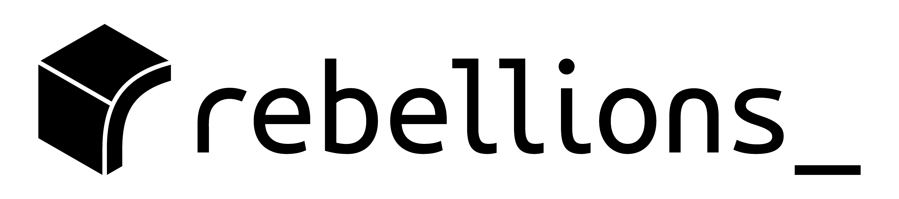
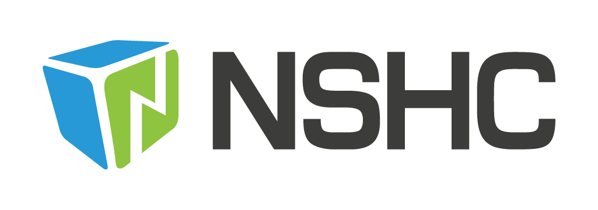

<h1>

한국정보과학회 프로그래밍언어연구회 겨울학교
  (SIGPL Winter School 2026)

</h1>

<table><tbody><tr><th align="left">
<ul>
<li>
    일시: 2026년 2월 4일 (수) ~ 2025년 2월 6일 (금)
</li><li>
    장소: 울산 머큐어 엠버서더 호텔
</li><li>
    주최: 한국정보과학회 프로그래밍언어연구회
</li><li>
    후원: FuriosaAI, 리벨리온, NSHC
</li>
</ul>
</th></tr></tbody></table>

<h2>초대의 글</h2>

한국정보과학회 프로그래밍언어연구회에서 주최하는 2026 겨울학교에 여러분을 초대합니다.

이번 겨울학교에서는 국내외, 학계와 산업계에 계시는 다양한 분들을 모시고 프로그래밍언어, 컴파일러, 보안 등 다양한 분야의 이야기를 듣는 시간을 마련했습니다.
또한 예년과 마찬가지로 국내 주요 연구실에서 진행 중인 다양한 연구들을 직접 만나볼 수 있는 포스터 세션,
PL 분야 여러 교수님들의 진솔한 이야기를 들을 수 있는 자리도 준비했습니다.
여러분의 많은 관심과 참여 바랍니다.

한국정보과학회 프로그래밍언어연구회  
운영위원장 <a href="https://psl.hanyang.ac.kr/">이우석</a> (한양대)

2026 프로그래밍언어연구회 겨울학교 
조직위원장 허기홍 (KAIST) 
프로그램위원장 류석영 (KAIST)

<!--
<h2> 참가자 단체사진</h2>

<ul>
    <li>더 많은 사진은 <a href="https://drive.google.com/drive/folders/1vm2vUbVDa6Gej3t4EGxYcF130jbHMNg7" target="_blank">링크</a>에서 확인할 수 있습니다.</li>
</ul>
-->

<h2>프로그램</h2>

<ul>
  <table border="0" cellspacing="0">
  <tbody><tr><td bgcolor="#cccccc">
  <table border="0" cellspacing="1pt">
<tbody>
  <tr><th colspan="3" align="left"> 2월 4일 (수요일) </th></tr>
  <tr><td bgcolor="white"> 13:00 ~ 14:00 </td> <td bgcolor="white"> 등록 </td><td bgcolor="white"> </td></tr>
  <tr><td bgcolor="white"> 14:00 ~ 15:00 </td> <td bgcolor="white"> Understanding Wasm Malware Detection and Evasion </td><td bgcolor="white"><a href="https://seclab.skku.edu/people/hyoungshick-kim/">김형식</a>(성균관대)</td></tr>
  <tr><td bgcolor="white"> 15:00 ~ 15:15 </td> <td bgcolor="white"> 휴식 </td><td bgcolor="white"></td></tr>
  <tr><td bgcolor="white"> 15:15 ~ 16:15 </td> <td bgcolor="white"> The Journey from AIxCC to Samsung Internal AI-Powered Security Solution </td><td bgcolor="white"> 장준언(삼성전자) </td></tr>
  <tr><td bgcolor="white"> 16:15 ~ 16:30 </td> <td bgcolor="white"> 휴식 </td><td bgcolor="white"></td></tr>
  <tr><td bgcolor="white"> 16:30 ~ 17:30 </td> <td bgcolor="white"> Practical Challenges of Python Core Team </td><td bgcolor="white"> <a href="https://www.linkedin.com/in/donghee-na-2b713b49">나동희</a>(당근) </td></tr>
  <tr><td bgcolor="white"> 17:30 ~ 19:30 </td> <td bgcolor="white"> 저녁 식사 </td><td bgcolor="white"></td></tr>
  <tr><td bgcolor="white"> 19:30 ~ 21:00 </td> <td bgcolor="white"> 포스터 세션 </td><td bgcolor="white"></td></tr>

  <tr><th colspan="3" align="left"> 2월 5일 (목요일) </th></tr>
  <tr><td bgcolor="white"> 10:00 ~ 11:00 </td> <td bgcolor="white"> C를 러스트로 번역하기: 분석으로, LLM으로, 아니면 함께? </td><td bgcolor="white"><a href="https://hjaem.info">홍재민</a>(KAIST / Yale University)</td></tr>
  <tr><td bgcolor="white"> 11:00 ~ 11:15 </td> <td bgcolor="white"> 휴식 </td><td bgcolor="white"></td></tr>
  <tr><td bgcolor="white"> 11:15 ~ 12:15 </td> <td bgcolor="white"> Effective Testing of Confluence of a Rewriting System </td><td bgcolor="white"><a href="https://www.cse.chalmers.se/~koen/">Koen Claessen</a>(Chalmers University of Technology)</td></tr>
  <tr><td bgcolor="white"> 12:15 ~ 14:00 </td> <td bgcolor="white"> 점심 식사 </td><td bgcolor="white"> </td></tr>
  <tr><td bgcolor="white"> 14:00 ~ 15:00 </td> <td bgcolor="white"> Inductive Testing of Compilers and Interpreters </td><td bgcolor="white"><a href="https://www.cse.chalmers.se/~koen/">Koen Claessen</a>(Chalmers University of Technology)</td></tr>
  <tr><td bgcolor="white"> 15:00 ~ 15:15 </td> <td bgcolor="white"> 휴식 </td><td bgcolor="white"></td></tr>
  <tr><td bgcolor="white"> 15:15 ~ 15:35 </td> <td bgcolor="white"> (후원기업발표) Unlock Furiosa RNGD's Full Potential with Low-Level API </td><td bgcolor="white">강지훈(FuriosaAI)</td></tr>
  <tr><td bgcolor="white"> 15:35 ~ 15:45 </td> <td bgcolor="white"> (후원기업발표) NSHC LLVM 연구소 소개 </td><td bgcolor="white">최정필(NSHC)</td></tr>
  <tr><td bgcolor="white"> 15:45 ~ 16:00 </td> <td bgcolor="white"> 휴식 </td><td bgcolor="white"></td></tr>
  <tr><td bgcolor="white"> 16:00 ~ 18:00 </td> <td bgcolor="white"> Not-So-New Faculty Talks </td><td bgcolor="white">
<a href="https://psl.hanyang.ac.kr">이우석</a>(한양대)
<a href="https://prl.korea.ac.kr/">오학주</a> (고려대)
<a href="https://sf.snu.ac.kr/gil.hur/">허충길</a>(서울대)
<a href="https://plrg.kaist.ac.kr/">류석영</a>(KAIST) </td></tr>
  <tr><td bgcolor="white"> 18:00 ~ 18:10 </td> <td bgcolor="white"> 사진 촬영 </td><td bgcolor="white"> </td></tr>
  <tr><td bgcolor="white"> 18:10 ~ 20:00 </td> <td bgcolor="white"> 저녁 만찬 </td><td bgcolor="white"> </td></tr>

  <tr><th colspan="3" align="left"> 2월 6일 (금요일) </th></tr>
  <tr><td bgcolor="white"> 10:00 ~ 11:00 </td> <td bgcolor="white"> Using Numerical Optimization to Generate Test Data That Is Likely to Trigger a Bug </td><td bgcolor="white"><a href="https://www.cse.chalmers.se/~koen/">Koen Claessen</a>(Chalmers University of Technology)</td></tr>
  <tr><td bgcolor="white"> 11:00 ~ 11:15 </td> <td bgcolor="white"> 휴식 </td><td bgcolor="white"></td></tr>
  <tr><td bgcolor="white"> 11:15 ~ 12:15 </td> <td bgcolor="white"> LLM 기반 심리상담 챗봇의 가능성과 한계 </td><td bgcolor="white"> <a href="https://unisthailab.notion.site">정두영</a>(KAIST) </td></tr>
  <tr><td bgcolor="white"> 12:15 ~ 12:30 </td> <td bgcolor="white"> 폐회 및 포스터 시상</td><td bgcolor="white">
<a href="https://plrg.kaist.ac.kr/">류석영</a>(KAIST) </td></tr>
</tbody>
  </table></td></tr></tbody></table>
</ul>

<h2>등록</h2>

<ul>
  <li> 사전등록 마감: 2026년 1월 23일 (금요일)</li>
  <li> 등록 방법: <a href="https://www.kiise.or.kr/conference/conf/185/" target="_blank">등록 페이지</a>를 통해 신청 가능합니다.
  사전 등록 기간 이후에도 등록 페이지를 통해 일반 등록으로 신청하실 수 있습니다.
  <table border="1" bordercolor="#a0a0a0" cellspacing="0">
  <tbody><tr><th>&nbsp;</th><th>학생</th><th>일반</th></tr>
  <tr align="center"><th>사전 등록 </th><td>200,000원</td><td>300,000원</td></tr>
  <tr align="center"><th>일반 등록 </th><td>250,000원</td><td>400,000원</td></tr>
  <tr align="center"><th>특별 할인 </th><td>10,000원</td><td>10,000원</td></tr>
  <tr align="center"><th>명예 회원 </th><td></td><td>무료</td></tr>
  </tbody></table>
  </li>
  <li>
    특별 할인
    <ul>
        <li>
        올해에도 "특별 할인"을 통해 연구비가 부족한 경우에 지원하고자 합니다.
        지원을 위해서는 지도교수 추천서가 필요합니다.
        더 다양한 학생들에게 기회를 드리고자, 한 지도교수 당 최대 5명까지만 추천을 받습니다.
        </li>
        <li><a href="https://www.kiise.or.kr/conference/conf/185/">등록 페이지</a>에서 동일하게 정보 작성하고 아래의 사항을 적용하여 등록합니다.
            <ul>
                <li> 참가신청 결제 - 결제방법: 계좌이체 선택 </li>
                <li> 입금 메모에 "특별할인" 기재</li>
            </ul>
        </li>
        <li><a href="https://docs.google.com/forms/d/e/1FAIpQLSdi8nE-Dilr33Ve5B-WBvGWlEC7d01u4YatTYIYqtKo91q8HA/viewform?usp=publish-editor">구글폼</a>을 통해 지원해 주시면 승인 시 메일에 결제 링크가 포함되어 전달됩니다.</li>
        <li>지원마감: 2026년 1월 16일(금)</li>
    </ul>
  </li>
  <li>계절학교에서 제공되는 식사는 수요일 저녁, 목요일 점심/저녁입니다.</li>

</ul>

<!--
<h2>포스터 발표 신청</h2>
<ul>
  <li>
  <a href="https://docs.google.com/forms/d/e/1FAIpQLSci1vDwfJyWNx-0TNVogtSr8wVV1QFDXM3OnpN6DubkyFlBLg/viewform?usp=header" target="_blank">
  포스터 신청 구글폼</a>을 통해 8월 11일(월요일)까지 신청해 주시기 바랍니다.
  </li>
  <li>
  올해 여름학교는 별도의 번개발표 없이 포스터 발표만 진행됩니다. 그 대신
  연구실 별로 진행하는 발표를 신청 받고 있으므로, 해당 세션을 통해 학생들의
  다양한 발표를 들어볼 수 있기를 기대합니다.
  </li>
  <li>
  작년과 마찬가지로, 포스터 세션에서 쉬운 용어로 좋은 발표를 진행한 학생에게 세종 발표상을 수여합니다.
  </li>
</ul>
-->

<h2>오시는 길</h2>
<ul>
  <li> 행사 장소: <a href="https://www.ambatel.com/mercure/ulsan/ko/main.do" target="_blank">머큐어 앰버서더 울산</a></li>
</ul>

<h2>숙박안내</h2>
<ul>
  <li>
    행사장소인 머큐어 앰버서더 울산 호텔에 묵으실 경우 수페리어 더블/트윈 객실을 1박당 90,000(조식불포함)에 특별 예약하실 수 있습니다.
    예약 시 "프로그래밍언어연구회" 라고 말씀해 주셔야 특별 할인 요금으로 적용됩니다. 특별 예약은 전화나 이메일로만 가능합니다.
    신청 현황에 따라 조기 마감될 수 있으니, 미리 예약해 주시기 바랍니다.
    <ul>
    <li>전화: 052-980-1101 (대표번호: 1)</li>
    <li>이메일: <a href="mailto:maursvn@ambatel.com">maursvn@ambatel.com</a> (이름, 연락처, 객실타입, 인원, 조식이용여부 기재)</li>
    </ul>
  </li>
  <li>그 외의 경우, 근처 호텔에 개별적으로 예약해주시기 바랍니다.</li>
</ul>

<h2>후원 모집</h2>
2026 SIGPL 겨울학교 후원 기업을 모집하고 있습니다.
후원에 관심이 있으신 기업에서는 조직위원장 <a href="mailto:kihong.heo@kaist.ac.kr">허기홍 교수</a>에게 이메일로 문의해주시면 후원 혜택을 안내해드립니다.

<h2>후원사 소개</h2>
<ul>
  <table border="0" cellspacing="0">
  <tbody><tr><td bgcolor="#cccccc">
  <table border="0" cellspacing="1pt">
<tbody>
  <tr><th colspan="2" align="left"> 골드 후원사</th></tr>
  <tr>
    <td bgcolor="white"></td>
    <td bgcolor="white" style="width:800">
FuriosaAI는 대한민국을 대표하는 인공지능 반도체 기업으로서 이재명 정부 1호 유니콘 기업이 되었습니다.
대규모 언어모델(LLM)을 고효율로 가속할 수 있는 2세대 AI 반도체 RNGD의 양산을 앞두고 있습니다.
Meta, OpenAI, LG AI Research, UpstageAI, Aramco 등 세계 유수 기업들이 관심을 보일 정도로 높은 기술력과 인지도를 인정받으며,
글로벌 AI 반도체 시장에서 혁신을 주도하는 기업으로 자리매김하고 있습니다.
    </td>
  </tr>
  <tr>
    <td bgcolor="white"></td>
    <td bgcolor="white" style="width:800">
리벨리온은 대규모 AI 시대에 필요한 에너지 효율성과 확장성을 갖춘 AI 전용 가속기를 개발하고 있습니다.
LLM부터 멀티모달 AI까지, 리벨리온의 칩렛, 인터커넥트, 소프트웨어 스택은 하이퍼스케일 환경에서의 빠르고 확장 가능하며
전력 효율적인 배포를 위해 설계되었습니다. 글로벌 기술 파트너들의 지원과 검증된 대규모 구축 경험을 바탕으로,
소버린AI와 상업 분야를 아우르는 미래 AI 인프라를 만들어가고 있습니다.
    </td>
  </tr>
  <tr><th colspan="2" align="left"> 브론즈 후원사</th></tr>
  <tr>
    <td bgcolor="white"></td>
    <td bgcolor="white" style="width:800">
2004년 해커들의 모임으로 시작된 NSHC는 2008년 법인 설립 후, 국내는 물론 싱가포르와 일본 등의 해외 지사를 기반으로
아시아 최고의 정보보안 기업을 목표로 보안 컨설팅, 모바일 보안 솔루션 개발, 악성코드 분석 및 취약점 정보 제공(ISAC)에
집중하고 있는 정보보안 벤처기업입니다. 모바일 보안 솔루션 시장에서는 점유율 1위를 차지하고 있으며, 국내 약 180개의
스마트폰 금융 애플리케이션에 제품을 공급하고 있고, 2025년 기준 94명의 임직원과 함께 연매출 127억을 달성하고 있습니다.
2017년 LLVM 4.0 기반 난독화 솔루션 개발을 시작으로, 최신 버전의 LLVM까지 Swift 지원을 포함한 안정적인 업데이트와 기술
지원을 성공적으로 이어오고 있으며, 2022년에는 그동안 축적된 기술력을 바탕으로 LLVM 연구소를 설립해 컴파일러 기반 보안 솔루션을
OT·국방등 다양한 분야에 적용하려는 한편, Edge AI 플랫폼과 정형검증등의 연구개발에도 집중하고 있습니다
    </td>
  </tr>
</tbody>
  </table></td></tr></tbody></table>
</ul>

